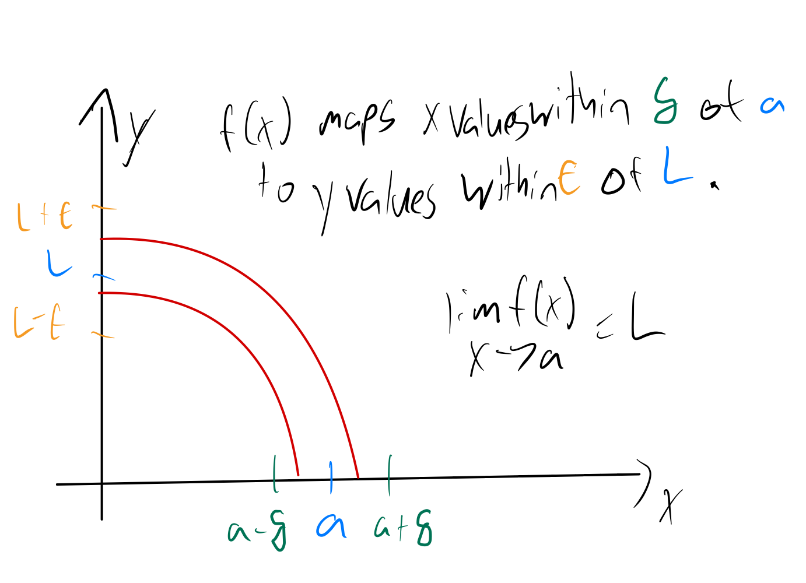

# Limits of a Function

## Delta Epsilon Definition of a Function on an Interval

Let $I$ be an open interval containing $a$, and let $f$ be a function defined on $I$, except possibly at $a$. The **limit** of $f(x)$ as $x$ approaches $a$ is $L$, donoted as

$$ \lim_{x \to a} f(x) = L, $$

means that given any $\epsilon > 0$, there exists $\delta > 0$ such that for all $x \neq a$, if $\|x - a\| < \delta$, then $\|f(x) - L\| < \epsilon.$

This means that when we pick any value of $\epsilon > 0$ first to make a range of $y$ values around $L$, that is, $\|y - L\| < \epsilon$, if we can always find a value of $\delta > 0$ around $a$ such that when $\|x - a\| < \delta$, $\|f(x) - L\| < \epsilon$, then the limit as $x$ approaches $a$ is $L$.

### Example

Prove

$$ \lim_{x \to 1} \frac{3x(x-1)}{x-1} = 3. $$

We need to show that given $\epsilon > 0$, there exists $\delta > 0$ such that

$$  0 < |x - 1| < \delta \implies \left | \frac{3x(x-1)}{x-1} - 3 \right | < \epsilon  $$

Basically, we need to find $\delta$ as a function of $\epsilon$ here to show that no matter what the value of $\epsilon$ is, we can find a satisfactory $\delta$.

We can do this with some algebraic manipulation:

$$ \left | \frac{3x(x-1)}{x-1} - 3 \right | < \epsilon \iff \left |3x - 3 \right | < \epsilon \iff |x -1| < \frac{\epsilon}{3} $$

Now we've shown that as long as $\|\delta\| < \frac{\epsilon}{3}$, then $\|f(1 - \delta) - 3\| < \epsilon$.

## Limits of a Function on a Set of Real Numbers

This is more general than the definition above in that it applies to the case where there domain is a set of real numbers, not  just an interval.

Let $A$ be a set of real numbers and $f(x)$ be a function $f : A \to \mathbb{R}.$ The **limit** of $f(x)$ as $x$ approaches $a$ is $L,$ written 

$$ \lim_{x \to a}{f(x)} = L $$

if for every $\epsilon > 0$ there exists some $\delta > 0$ such that $\|f(x) - L\| < \epsilon$ if $0 < \|x - a\| < \delta.$ We assume $a$ is a real number and that there are numbers $x \in A$ satisfying $0 < \|x - a\| < \delta.$

## Limits of Function Rules

Suppose $\lim_{x \to a}{f(x)} = L, \lim_{x \to a}{g(x)} = M$ and $c \in \mathbb{R}.$ Then

$$ \begin{align} \lim_{x \to a}{f(x) + cg(x)} & = L + cM, \\

  \lim_{x \to a}{f(x)g(x)} & = LM, \\

 \lim_{x \to a}{\frac{f(x)}{g(x)}} & = \frac{L}{M}, ~ M \neq 0. \end{align} $$

(same assumption as given above applies for the domains of $f,$ $g$ containing values near $a.$

## One-Sided Limits
Let $A$ be a set of real numbers containing $a$ and $f(x)$ be a function $ : A \to \mathbb{R}.$ The limit of $f(x)$ as $x$ approaches $a$ **from the right** is $L,$ written 

$$ \lim_{x \to a^+}{f(x)} = L $$

if for every $\epsilon > 0$ there exists a $\delta > 0$ such that $\|f(x) - L\| < \epsilon$ if $a < x < a + \delta.$ We assume there are numbers $x \in A$ satisfying $a < x < a + \delta.$

Let $A$ be a set of real numbers containing $a$ and $f(x)$ be a function $f : A \to \mathbb{R}.$ The limit of $f(x)$ as $x$ approaches $a$ **from the left** is $L,$ written 

$$ \lim_{x \to a^-}{f(x)} = L $$

if for every $\epsilon > 0$ there exists a $\delta > 0$ such that $\|f(x) - L\| < \epsilon$ if $a - \delta < x < a.$ We assume there are numbers $x \in A$ satisfying $a - \delta < x < a.$

*Theorem*: Let $A$ be a set of real numbers containing $a$ and $f(x)$ be $f : A \to \mathbb{R},$ and assume that for every $\delta > 0$ there are numbers $x \in A$ satisfying $0 < \| x - a \| \delta.$ Then $\lim_{x \to a}{f(x)} = L$ if and only if $\lim_{x \to a^-}{f(x)} = \lim_{x \to a^+}{f(x)} = L.$

## Limits Involving Infinity
Let $A$ be a set of real numbers and $f(x)$ a function from $A$ into $\mathbb{R}.$ We say that the limit of $f(x)$ as $x$ approaches infinity is $L,$ written as

$$ \lim_{x \to \infty}{f(x)} = L, $$

if for every $\epsilon > 0$ there exists a real number $M$ such that $\|f(x) - L\| < \epsilon$ if $x \geq M.$ 

Let $A$ be a set of real numbers and $f(x)$ a function from $A$ into $\mathbb{R}.$ We say that the limit of $f(x)$ as $x$ approaches negative infinity is $L,$ written as

$$ \lim_{x \to - \infty}{f(x)} = L, $$

if for every $\epsilon > 0$ there exists a real number $M$ such that $\|f(x) - L\| < \epsilon$ if $x \leq M.$ 
## Tricks

### Factoring a root out of a numerator

Say we have:

$$ \lim_{n \to \infty} \frac{n + 1}{\sqrt{(n + 1)(2n+1)}} $$

Since $n$ is going to infinity it is positive and for positive $n$, $n + 1 = \sqrt{(n+1)^2)$ we can factor out a root to simplify:

$$ \lim_{n \to \infty}  \frac{\sqrt{(n + 1)^2}}{\sqrt{(n + 1)(2n+1)}} =  \lim_{n \to \infty} \sqrt{\frac{(n + 1)^2}{(n + 1)(2n+1)}} =  \lim_{n \to \infty} \sqrt{\frac{n+1}{2n+1}}  $$

From there we can move the limit inside the radical:

$$ \sqrt{\lim_{n \to \infty} \frac{n + 1}{2n + 1}} = \sqrt{\frac{1}{2}} = \frac{\sqrt{2}}{2}$$
