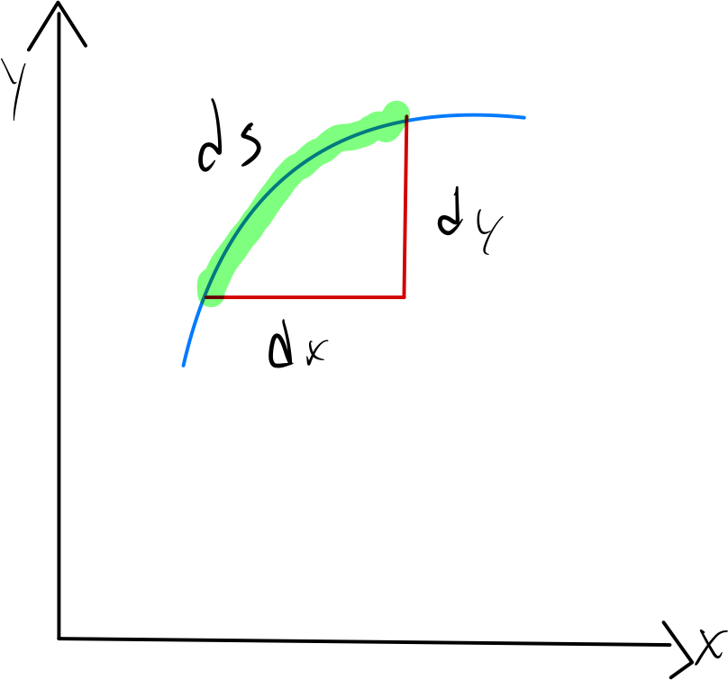

# Arc Length and Line Integrals

## Lengths of Parametric Curves

A function with a continuous first derivative is said to be **smooth**.

For a parametrically defined function where $x = f(t), y = g(t)$, both $f'$ and $g'$ must be continuous.

If we think of a curve in a plane, we can think of the arc length differential $ds$ as the "hypotenuse" of small triangles whose sides are $dx$ and $dy$.

This makes

$$ ds = \sqrt{dx^2 + dy^2} $$

and the differential formula for arc length is then:

$$ L = \int ds $$

If a smooth curve $x = f(t), y = g(t), a \le t \le b$, is traversed exactly once as $t$ increases from $a$ to $b$, the curve's length is

$$ L = \int_a^b ds = \int_a^b \sqrt{ \left ( \frac{dx}{dt} \right )^2 + \left ( \frac{dy}{dt} \right )^2} dt $$

The arc length of curve in $\mathbb{R}^3$ can be defined the same way, assuming $z = h(t)$:

$$ L = \int_a^b ds = \int_a^b \sqrt{ \left ( \frac{dx}{dt} \right )^2 + \left ( \frac{dy}{dt} \right )^2 + \left ( \frac{dz}{dt} \right )^2 } dt $$

Note that the arc length formula for both 2 and 3 dimensions can be written using vector notation in the more compact form:

$$ L = \int_a^b \left |\vec{r'}(t) \right | dt $$
