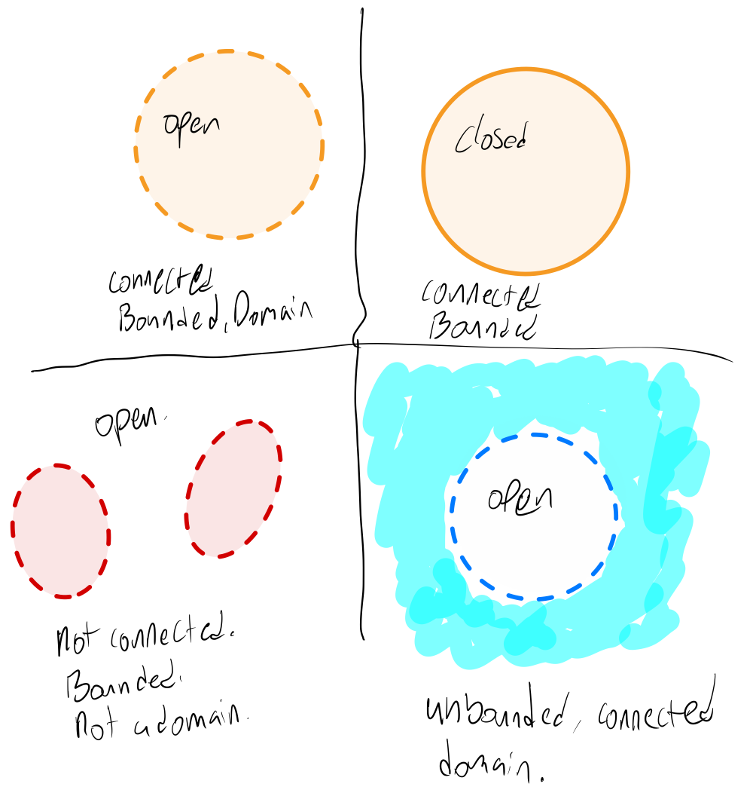

# Regions of the Complex Plane

An **$\epsilon$-neighborhood** of a point $z_0$ is the set of all complex numbers $z$ satisfying

$$ | z - z_0 | < \epsilon. $$

This is the set of all complex numbers interior to a circle of radius $\epsilon$ and center $z_0$, but not including the circumference of the circle.

A point $z$ of a set $S$ of comlex numbers is called an **interior point** of $S$ if there exists an $\epsilon$-neighborhood of $z$ that contains only points of $S$.

On the other hand, $z$ is a **boundary point** of $S$ if every $\epsilon$-neighborhood of $z$ contains at least one point of $S$ and at least one point not in $S$. The set of all boundary points of a set $S$ is called the **boundary** of $S$.

A set $S$ of complex numbers is said to be **open** if all points in $S$ are interior points. Alternatively, a set is open if it contains none of its boundary points.

A set $S$ of complex numbers is said to be **closed** if it contains all of its boundary points.

Note that a set can be both open and closed! Both the empty set and $\mathbb{C}$ are both open and closed.

A set $S$ of complex numbers is said to be **bounded** if there exists a positive (real) number $R$ such that $\|z\| < R$ for all $z$ in $S$. This means that a set is bounded if all its points fit within a circle of finite radius. A set that is not bounded is said to be **unbounded**.

A set $S$ is said to be **connected** if every pair of points in $S$ can be joined by a finite number of line segments joined end to end that lie entirely within $S$.

A **domain** is an open connected set. Note that this is not the same as a domain of definition of a function.

In the images below, a dashed line represents a boundary that is not included the in the set, while a solid line represents a boundary that is included in the set.

Squiggly blue highlighter indicates the set goes on forever and the party never ends!

