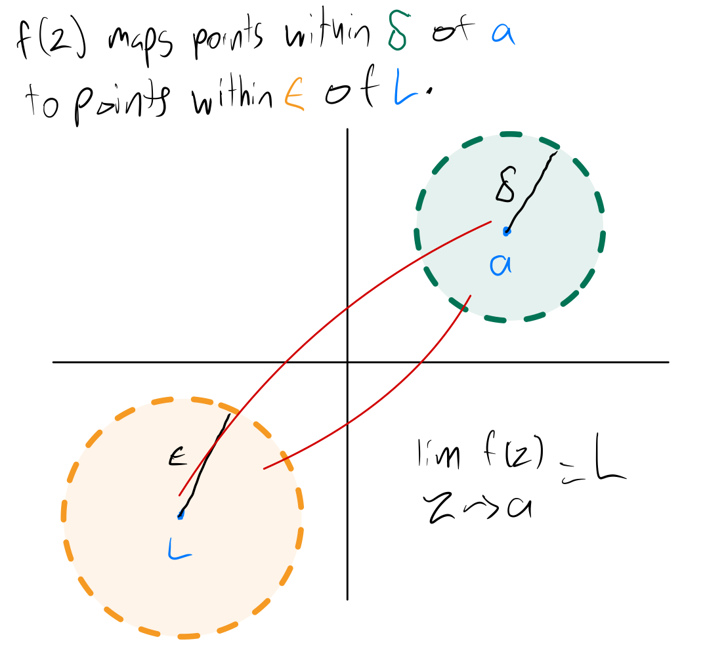

# Limits of Complex Functions

See first the [Limits notes for two dimensional functions](../calculus/limits.html).

## Delta Epsilon Definition

Let $S$ be an open set containing $a$, and let $f$ be a function defined on $S$, except possibly at $a$. The **limit** of $f(z)$ as $z$ approaches $a$ is $L$, donoted as

$$ \lim_{z \to a} f(z) = L, $$

means that given any $\epsilon > 0$, there exists $\delta > 0$ such that for all $z \in S, z \neq a$, if $\|z - a\| < \delta$, then $\|f(z) - L\| < \epsilon.$

This means that when we pick any value of $\epsilon > 0$ first to make an open disc of $w$ values around $L$, that is, $\|w - L\| < \epsilon$, if we can always find a value of $\delta > 0$ such that when $\|z - a\| < \delta$, $\|f(z) - L\| < \epsilon$, then the limit of $f(z)$ as $z$ approaches $a$ is $L$.

This is similar to limits of two dimension functions, except that instead of having open intervals on the $x$ and $y$ axis, respectively, around $a$ and $L$, we have open discs in the $z$ and $w$ planes, respectively, around $a$ and $L$.

Whereas for limits on the 2d plane to exist, we need to get the same limit approaching from the left or right of $a$, for limits on the complex plane to exist, we need to get the same limit approaching $a$ from any direction.
