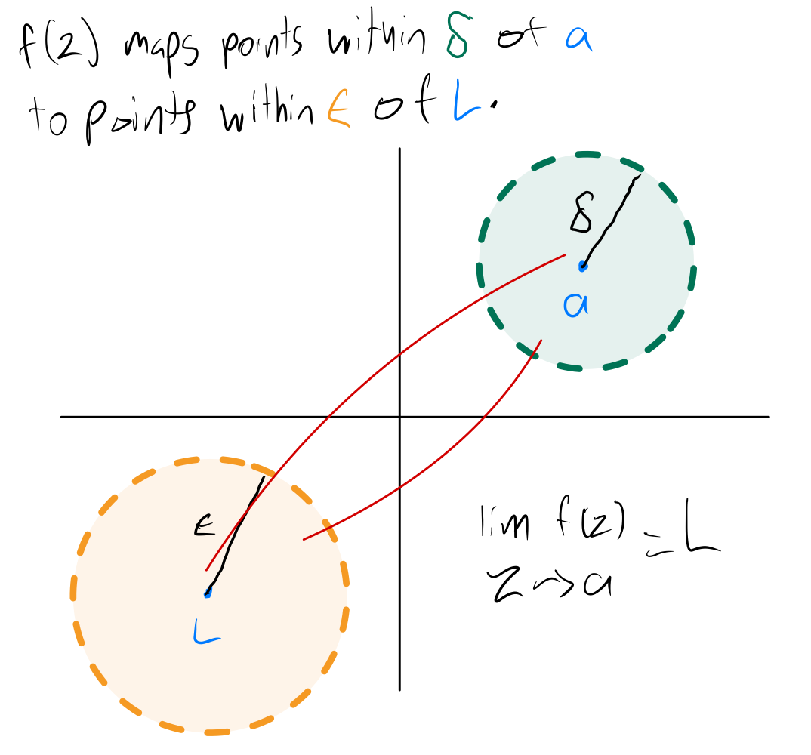

# Limits of Complex Functions

See first the [Limits notes for two dimensional functions](../calculus/limits-of-a-function.html).

## Delta Epsilon Definition

Let $S$ be an open set containing $a$, and let $f$ be a function defined on $S$, except possibly at $a$. The **limit** of $f(z)$ as $z$ approaches $a$ is $L$, donoted as

$$ \lim_{z \to a} f(z) = L, $$

means that given any $\epsilon > 0$, there exists $\delta > 0$ such that for all $z \in S, z \neq a$, if $\|z - a\| < \delta$, then $\|f(z) - L\| < \epsilon.$

This means that when we pick any value of $\epsilon > 0$ first to make an open disc of $w$ values around $L$, that is, $\|w - L\| < \epsilon$, if we can always find a value of $\delta > 0$ such that when $\|z - a\| < \delta$, $\|f(z) - L\| < \epsilon$, then the limit of $f(z)$ as $z$ approaches $a$ is $L$.

This is similar to limits of two dimension functions, except that instead of having open intervals on the $x$ and $y$ axis, respectively, around $a$ and $L$, we have open discs in the $z$ and $w$ planes, respectively, around $a$ and $L$.

Whereas for limits on the 2d plane to exist, we need to get the same limit approaching from the left or right of $a$, for limits on the complex plane to exist, we need to get the same limit approaching $a$ from any direction.

## Continuity

A complex function $f$ is said to be **continuous** at $z = z_0$ if

$$ \lim_{z \to z_0} f(z) = f(z_0) $$

The function is said to be continuous on an open set if it is continuous at each point in the set. This definition imposes three conditions of the function $f$:

1. $f$ must be defined at $z_0$;

2. the limit of $f$ as $z \to z_0$ must exist;

3. the numbers in 1. and 2. must be identical.

Continuous functions can be added, subtracted, multiplied, and divided, and their results will still be continuous.

A discontinuity in a function $f$ at $z_0$ is said to be a **removable discontinuity** if we can assign a value to the function $f$ at $z_0$ that makes the function continuous.

## Branches, Branch Points and Branch Cuts

A multi-valued function such as $\arg{z}$ can be made single valued by restricting its range. For example, if we restrict the range of $\arg{z}$ to be $0 \le \arg{z} < 2 \pi$, then it is single valued. $\arg{z}$ restricted in this manner will be discontinuous at $z = 0$ and along the positive real axis.

We could similarly restrict the range to any other interval $[\phi, \phi + 2 \pi)$ and call this fuction $\arg_{\phi}{z}$ and it will be discontinuous at $z = 0$ and along the half-line that forms the angle $\phi$ with the positive real axis.

This restricted range version of $\arg{z}$ is said to be a **branch** of $\arg{z}$. The half-line along which it is discontinuous is called the **branch cut** of the branch, and the point $z = 0$ at which all branch cuts meet is called the **branch point** of the multi-valued function $\arg{z}$.
