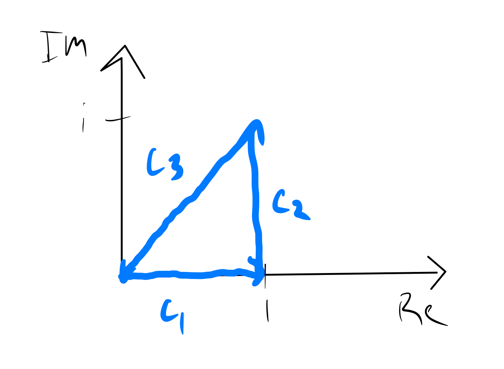

# Contour Integrals

A contour integral is essentially a [line integral](../calculus/line-integrals.html) in the complex plane.

Given a smooth curve $C$ in a domain $D$ and $f(z) = u(x,y) + v(x,y)i$ a contiuous function defined along $C$, we say that

$$ \int_{C} f(z) dz = \int_C (u+vi)(dx + dyi) = \int_C u dx - vdy + i \int_C vdx + u dy. $$

We can parameterize $C$ such that

$$ C : z = z(t) = x(t) + y(t)i, \quad \alpha \le t \le \beta $$

Then we have 

$$ \int_C f(z) dz = \int_\alpha^\beta f[z(t)]z'(t) dt $$

One trick we can use is that when the modulus of a function is constant, we can use the argument of $z$ as a parameter by writing $C: z = e^{\theta i}, \arg{\alpha} \le \theta \le \arg{\beta}$

When the path of integration in a contour integral is a closed curve, we place a circle on the integral sign

$$ \oint_C f(z) dz. $$

You can add an arrow to the circle to indicate clockwise vs counterclockwise direction, but that's not supported in MathJax so I don't have it here!

Some additional properties:

$$ \text{Re} \int_C f(z) dz = \int_C \text{Re}[f(z)dz]; $$

$$ \text{Im} \int_C f(z) dz = \int_C \text{Im}[f(z)dz]; $$

$$ \left | \int_C f(z) dz \right | \le \int_C |f(z)||dz| \le ML $$

where $M$ is the maximum value of $\|f(z)\|$ for $z$ on $C$, and $L$ is the length of $C$.

Here's an example problem: evaluate $\oint_C e^z dz$ where $C$ is the closed (traingular) path from $0$ to $1$ ($C_1$) to $1 + i$ ($C_2$) back to $0$ ($C_3$):

$$ \oint_C e^z dz = \int_{C_1} e^z dz + \int_{C_2} e^z dz + \int_{C_3} e^z dz, $$

where

$$ C_1: y = 0, 0 \le x \le 1; $$

$$ C_2: x = 1, 0 \le y \le 1; $$

$$ C_3: x = t, y = t, 1 \ge t \ge 0; $$

Thus,

$$ \oint_C e^z dz = \int_0^1 e^x dx + \int_0^1 e^{1+yi}idy + \int_1^0 e^{t+ti} (dt +dt~i) $$

$$ = \left \{ e^x \right \}^1_0 + \left \{ e^{1+yi} \right \}^1_0 + \left \{ e^{(1+i)t} \right \}^0_1 $$ 

$$ = (e - 1) + (e^{1+i} -e) + (1 - e^{1 +i}) = 0. $$ 
