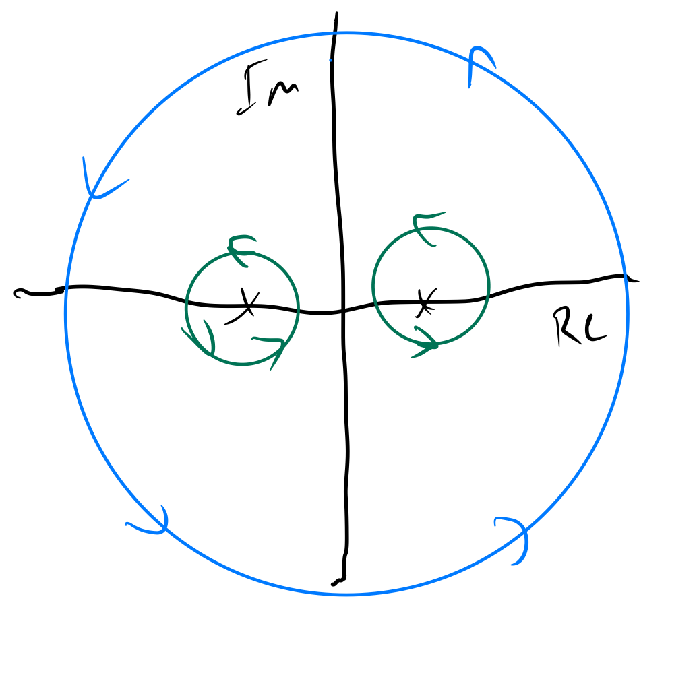

# Cauchy-Goursat Theorem

First, a less general theorem that can be shown using Green's theorem:

If the derivative $f'$ of a complex function $f$ is continuous in a domain containing a simple, closed, piecewise smooth curve $C$ and its interior, then

$$ \oint_c f(z) dz = 0. $$

The Cauchy-Goursat Theorem is more general and doesn't require continuity of $f'$:

If $f$ is analytic inside and on a closed, piecewise smooth curve $C$, then

$$ \oint_c f(z) dz = 0. $$

Note that $f$ has to be analytic both on and inside the piecewise smooth curve $C$. This means that if $C$ encloses a singularity, then Cauchy-Goursat can't be applied directly.

In these cases we can apply an extension of Cauchy-Goursat:

Let $C$ be a simple, closed piecewise smooth curve, and $C_1$, $C_2$, $\dots$, $C_n$ be disjoint, simple, closed piecewise smooth curves in the interior of $C$. If $f$ is analytic at all points that are both inside or on $C$, and outside or on each $C_j$, then

$$ \oint_c f(z) dz = \sum_{j=1}^n \oint_{C_j} f(z) dz. $$

This arms us with a method to find the following contour integral:

$$ \oint_C \frac{1}{z^2 - 1}, \quad C : |z| = 4. $$

Since $f(z) = \frac{1}{z^2 - 1}$ has singularities at $-1$ and $1$ that are completely encircled by $C$, it's not obvious whether or not $f$ has an antiderivative along $C$. However, we can apply the theorem above by encircling the singularities:

Now we can find our contour integral by evaluating the contour integrals on paths around our singularities, as these paths are analytic everywhere outside them but inside $C$.

A useful theorem to proceed from here is the following:

If $C$ is a simple, closed, piecewise smooth curve and $z_0$ is interior to $C$, then:

$$ \oint_C \frac{1}{z - z_0} dz = 2 \pi i. $$

Now, via partial fraction decomposition we have

$$ \oint_C \frac{1}{z^2 - 1} = \frac{1}{2} \oint_C \frac{1}{z-1} - \frac{1}{z+1} dz = \frac{1}{2}\left ( \oint_C \frac{1}{z - 1} dz - \oint_C \frac{1}{z + 1}dz \right ) = \frac{1}{2} \left ( 2 \pi i - 2 \pi i \right ) = 0. $$ 
