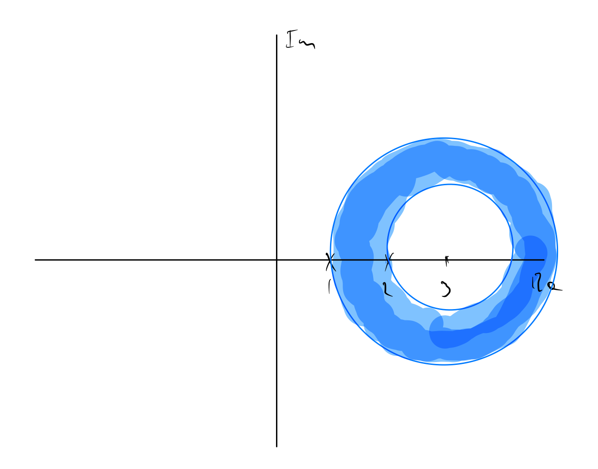

# Laurent Series

First, some background on geometric series.

The geometric series

$$ \sum_{n=0}^{\infty} ar^n $$

can be written as

$$ \frac{a}{1 - r} $$

and converges for $\|r\| < 1$.

Now, when we have a term like $\frac{1}{z-2}$ we can write

$$ \frac{1}{z -2} = -\frac{1}{2 - z} = - \frac{1}{2} \cdot \frac{1}{1 - \frac{z}{2} } = - \frac{1}{2}\sum_{n=0}^{\infty} \left ( \frac{z}{2} \right )^n, \tag{a} $$

and we can write

$$ \frac{1}{z - 2} = \frac{1}{z} \cdot \frac{1}{1 - \frac{2}{z}} = \frac{1}{z} \sum_{n=0}^{\infty} \left ( \frac{2}{z} \right )^n = \sum_{n=0}^{\infty} \frac{2^n}{z^{n+1}}. \tag{b} $$

The geometric series from (a) will converge when $z < 2$, and the geometric series from (b) will converge when $z > 2$. So, we have a choice of which geometric series to take, depending on the region of $z$ we want to work in.

**Laurent Expansion Theorem**. Let $f$ be analytic in an annulus $D : r < \|z - z_0\| < R$. Then $f(z)$ can be expressed in the form

$$ f(z) = \sum_{n=-\infty}^{\infty} a_n (z - z_0)^n $$

which converges and represents $f(z)$ in $D$.

Note the negative powers of $n$ - this is a distinguishing factor between Laurent series, which only apply to Complex functions and not Real functions, and Taylor series.

## Example

We will find the Laurent series for $f(z) = \frac{z}{z^2 - 3z + z}$ for $D : 1 < \| z - 3 \| < 2$.

We can factor the denominator of $f(z)$ to get

$$ f(z) = \frac{z}{z^2 - 3z + z} = \frac{z}{(z - 1)(z - 2)}. $$

This makes it evident that $f(z)$ has singularities at $z = 1, 2$, and our domain of definition is an annular disc centered at $z = 3$, with an internal disc of raidus $1$ and an annulus of width $1$ outside of that:

Now, via partial fraction decomposition we get

$$ \frac{z}{(z - 1)(z - 2)} = \frac{2}{z-2} - \frac{1}{z - 1}. $$

We need to use the two terms above to find geometric series in $(z-3)^n$ that converge for the interior of the annular disc, the region $\|z - 3\| < 1$, and the exterior of the annular disc, the region $\|z - 3\| > 2$.

Starting with the first term, we have

$$ \frac{2}{z-2} = \frac{2}{(z-3) + 1} = \frac{2}{(z - 3)(1 + \frac{1}{z - 3}} = \frac{2}{z-3} = \sum_{n=0}^{\infty} \frac{(-1)^n}{(z-3)^n} = \sum_{n=0}^{\infty} \frac{(-1)^n}{(z-3)^{n+1}}, $$

which converges for $\|z -3\| > 1$, which includes the region $\|z - 3\| > 2$. Note that this series involves negative integer powers of $(z -3)$ as the $(z - 3)$ term is in the denominator.

With the second term, we have

$$ \frac{-1}{z-1} = \frac{-1}{(z - 3) + 2} = \frac{-1}{2} \left ( \frac{1}{1 + \frac{z - 3}{2}} \right ) = \frac{-1}{2} \sum_{n=0}^{\infty} \left ( \frac{-(z - 3)}{2} \right )^n = \sum_{n=0}^{\infty} \frac{(-1)^{n+1}}{2^{n+1}}(z -3)^n,  $$

which converges for $\|z - 3\| < 2$, which includes the region $\|z - 3\| < 1.$ Note that this series involves positive integer powers of $(z - 3)$.

Combining the two, and adjusting the range of summation for the first series to get a $(z-3)^n$ term rather than $(z -3)^{n+1}$, we can add the two together to get

$$ f(z) = \sum_{n=1}^{\infty} \frac{(-1)^{n+1}}{(z-3)^{n}} + \sum_{n=0}^{\infty} \frac{(-1)^{n+1}}{2^{n+1}}(z -3)^n, ~ 1 < |z - 3| < 2. $$
