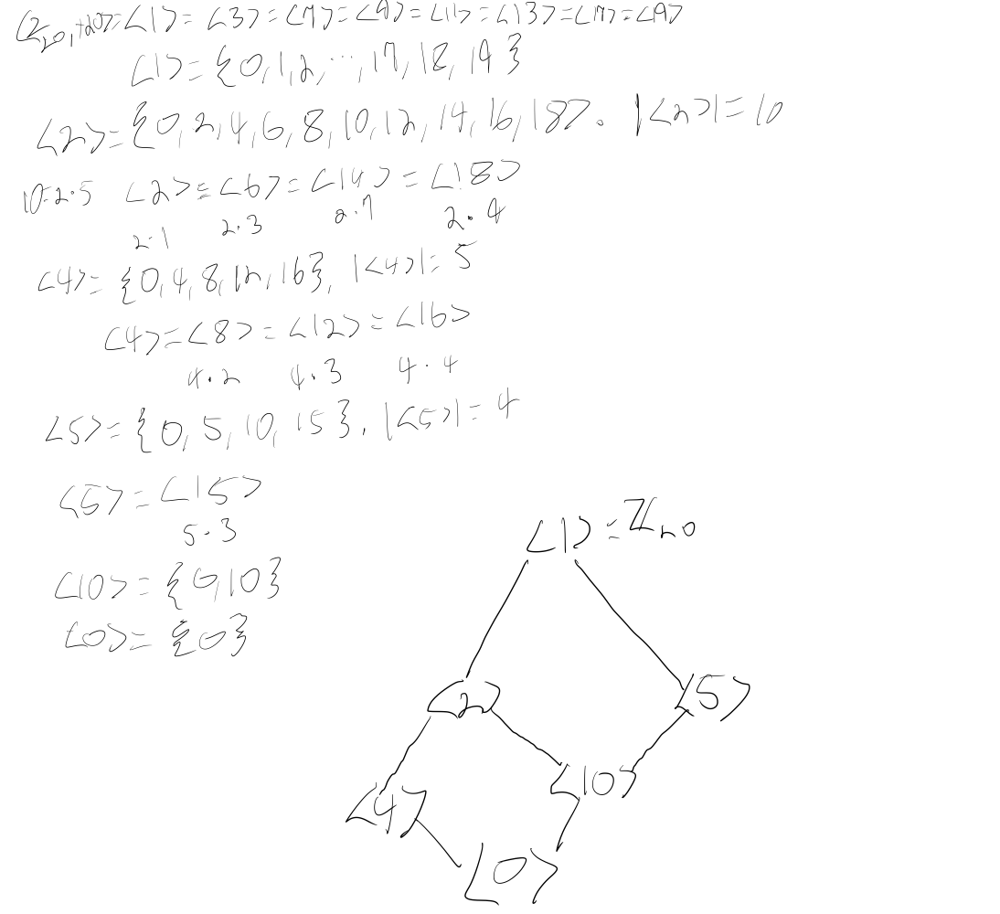

# Groups

## Definition

:::definition "group"
A group, is a set $G$ together with a binary operation $\*$ such that:

**Closure**: The set is closed under the binary operation. For all $a, b \in G, a \* b \in G$.

**Associativity**: The binary operation is associative on the set. For all $a, b, c \in G, (a \* b) \* c = a \* (b \* c)$.

**Identity**: The set contains an identity element, denoted $e$. For all $a \in G, a \* e = a$.

**Inverses**: All elements in the set have inverse elements in the set, denoted using $a^{-1}$. For all $a \in G$ there exists $a^{-1} \in G$ such that $a \* a^{-1} = e$.

This set/operation combination $G$ is commonly denoted as the pair $(G, \*)$.
:::

## Examples

Some examples of groups:

* The integers under addition: $(\mathbb{Z}, +)$. The identity element is $0$.

* The non-zero reals under multiplication: $(\mathbb{R}^{\*}, \*)$. The identity element is $1$.

* $n ~ x ~  n$ invertible matrices.

[Loads more listed here](https://en.wikipedia.org/wiki/Examples_of_groups).

A non-example is the naturals under addition - $(\mathbb{N}, +)$. The naturals are closed under addition, but there is no identity element since $0$ isn't included, and thus no inverses either.

## Abelian Groups

:::definition "Abelian"
Abelian groups are groups whose operation is commutative. For $a,b \in G, a \* b = b \* g$.
:::

The integers under addition are Abelian, because $a + b = b + a$, but invertible $n ~ x ~ n$ matrices are not, because it's not necessary that $AB = BA$.

## Finite Groups

The examples given so far are all infinite groups, but finite groups also exist.

For example, $(Z_4, +_4)$ i.e. $\{0, 1, 2, 3\}$ together with addition mod $4$ is a finite group.

## Subgroups

:::definition "subgroup"
A subgroup $H$ of a group $G$ is a subset of $G$ group together with the same operation as $G$ that still forms a group. The identity element of $G$ must also be the identity element of $H$.
:::

For example, the even integers under addition, $(2\mathbb{Z}, +)$, are a subgroup of the integers under addition.

:::definition "normal"
A subgroup $H$ of a group $G$ is normal if its left and right cosets coincide, that is, if $gH = Hg$, i.e. $gHg^{-1} = H$, for all $g \in G$. 
:::

## Cyclic Groups

:::definition "cyclic group"
A **cyclic group** is a group where there exists some $g \in G$ such that every element in $G$ can be generated from the group operation applied to $g$.

That is, $G = \{g^N | n \in \mathbb{Z}\}$ when we think of the operation as multiplication, or $G = \{ng | n \in \mathbb{Z}\}$ when we think of the operation as addition.
:::

We use angle brackets to denote an element as a generator. For example, $\langle 1 \rangle$ is a generator of $(\mathbb{N}, +)$, because every integer can be written as $n1$ for some $n \in \mathbb{Z}$.

:::definition "order"
The **order** of a finite group is the number of its elements. The order of group $G$ is denoted as $\text{ord}{(G)}$ or $\|G\|$. The order of an element $a$ (also called period length or period) is the number of elements in the subgroup generated by $a$, and is denoted by $\text{ord}{(a)}$ or $\|a\|$.
:::

### Cyclic Subgroups

:::definition "cyclic subgroup"
Any subgroup of a cyclic group is also cyclic - a cyclic subgroup.
:::

:::theorem
Let $G = \langle a \rangle$ be a cyclic group with $n$ elements. Let $b \in G$ and $b = a^s$. Then $b$ generates a cyclic subgroup of $G$ containing $\frac{n}{d}$ elements, where $d = \gcd(s, n)$. Two cyclic subgroups $\langle a^s \rangle$ and $\langle a^t \rangle$ are equal if and only if $\gcd(s,n) = \gcd(t, n)$.

::::proof
Suppose $g \in G$ with $\text{ord}(g) = n$ and let $m \in \mathbb{N}$. Then, $\langle g^m \rangle = \langle g^{\gcd{(m,n)}} \rangle$.

So, $ \langle g \rangle = \langle g^m \rangle \iff \gcd{(m,n)} = 1$.
::::
:::

Every element of a cyclic finite group will generate a cyclic subgroup. Some of these subgroups will be equivalent to others - we denote each subgroup $\langle g^s \rangle$, where $s$ is the smallest natural number that generates the subgroup.

To find the subgroups of a cyclic group, we follow this algorithm, keeping track of which elements we've found the generated subgroup for.

1. Some element $g$ will generator the entire group. If the group's order is $n$, then any element of the form $g^s$ where $s$ and $n$ are relatively prime will also generate the entire group, so note that we've found the generated subgroup for all of those elements.

2. Starting with the next $g^s$ not covered already, find the subgroup generated by it - all elements of $G$ of the form $(g^s)^k$. Note the order of this subgroup and call it $t$. Any elements of $G$ of the form $r \dot g^s$ where $r$ is relatively prime with $t$ will generate the same subgroup. Note that we've found the generated subgroup for all of those elements.

3. Repeat step 2 until we've found the subgroup generated by all elements.

This sounds really abstract, so here's an example of finding all of the subgroups of $(Z_{20}, +_{20})$

The diagram in this image is called a subgroup diagram or subgroup lattice. It represents containment - so a node being higher on the diagram indicates than any nodes below it are subsets of it.

## Permutations

If we rearrange the ordered set $A = \{1,2,3,4,5\}$ to another order, say $\{3,2,5,1,4\}$, then we get a permutation of $A$.

This rearrangement is a bijection from $A$ to $A$ that performs

$$ \begin{align} 1 \to 3 \\ 2 \to 2 \\ 3 \to 5 \\ 4 \to 1 \\ 5 \to 4 \end{align} $$

We can represent this permutation compactly using a matrix

$$ \begin{pmatrix} 1 & 2 & 3 & 4 & 5 \\ 3 & 2 & 5 & 1 & 4 \end{pmatrix} $$

Here, the top row is the input and the bottom row is the output, column-wise.

:::definition
A permutation is a bijection $\phi : A \to A$, that is, a bijection from a set onto itself.
:::

:::note
Generally, we talk about permutations on finite sets, but this doesn't seem to be a hard and fast rule.
:::

The set of all permutations on the set $A$ is denoted by $S_A$:

$$ S_A = \{ \phi : A \to A | \phi \text{ is a bijection} \} $$

When $A$ is the finite set $\{1, 2, 3, \cdots, n\},$ the group of all permutations of $A$ is the symmetric group on $n$ letters, and is denoted by $S_n$. It has $n!$ elements.

Permutations can be "multiplied", which is just composition. So if we have two permutations on $A$, called $\sigma$ and $\tau$, $\sigma \tau$ means their multiplication, and we apply from right to left, so $\tau$ applies first and then $\sigma$. The result will also be a permutation in $A$.

Permutation multiplication of permutations of a set forms a group:

:::theorem
Let $A$ be a nonempty set, and $S_A$ be the collection of all permutations of $A$. Then $S_A$ is a group under permutation multiplication.
:::

### Orbits

Let $\sigma$ be a permutation of $A$, the orbit of $\sigma$ containing $a \in A$ is the set

$$ \{ \cdots, \sigma^{-2}(a), \sigma^{-1}(a), a, \sigma{(a)}, \sigma^{2}(a), \cdots \} = \{\sigma^n(a) | n \in \mathbb{Z}\}. $$

So, $a,b \in A$ are in the same orbit of $\sigma$, written as $a \~ b$, if and only if $b = \sigma^n(a)$ for some $n \in \mathbb{Z}$.

The relation "~" is an equivalent relation (reflexive, symmetric, transitive). This means $A$ can be partitioned into orbits of $\sigma$.

:::definition
Let $\sigma$ be a permutation of $A$. The equivalence classes in $A$ determined by the equivalence relation "~" are the **orbits** of $\sigma$.
:::

Example:

Consider $\sigma = \begin{pmatrix} 1 & 2 & 3 & 4 & 5 & 6 & 7 & 8 \\\ 3 & 8 & 6 & 7 & 4 & 1 & 5 & 2 \end{pmatrix}$ in $S_8$. 
orbit of $\sigma = \begin{pmatrix} 1 & 2 & 3 & 4 & 5 & 6 & 7 & 8 \\\ 3 & 8 & 6 & 7 & 4 & 1 & 5 & 2 \end{pmatrix}$ 

* containing 1 is $\{1,3,6\}$ because $\sigma(1) = 3$, $\sigma(3) = 6$, and $\sigma(6) = 1$.

* containing 2 is $\{2,8\}$.

* containing 4 is $\{4, 5, 7\}$.

So the orbits of $\sigma$ are $\{1,3,6\}, \{2,8\}, \{4,5,7\}$.

### Cycles

:::definition
A permutation $\sigma \in S_n$ is a **cycle** if it has at most one orbit containing more than one elements. The length of a cycle is the number of elements in its largest orbit.
:::

A cycle in $S_n$ may be written as $(a_1, a_2, \cdots, a_k)$ - this is called cyclic notation. It represents the permutation that sends $a_1 \to a_2 \to \cdots \to a_k \to a_1$. 

:::definition "disjoint (cycle)"
Two or more than two cycles are **disjoint** if no element appears in more than one cycle.
:::

:::theorem
Every permutation $\sigma$ of a finite set is a product of disjoint cycles.
:::

### Even and Odd Permutations

:::definition "transposition"
A cycle of length 2 is a **transposition**.
:::

:::definition "even (permutation)"
A permutation of a finite set is **even** if it is the product of an even number of transpositions.
:::

:::definition "odd (permutation)"
A permutation of a finite set is odd if it is the product of an odd number of transpositions.
:::

:::theorem
A permutation in $S_n$ can be written as either a product of an odd number of transpositions or a product of an even number of transpositions, but not both.
:::

:::definition "alternating group"
The subgroup of $S_n$ consisting of all even permutations of $n$ letters is the **alternating group** $A_n$ on $n$ letters. If $n \geq 2$, then this set forms a subgroup of $S_n$ of order $n!/2$.
:::

### Cosets

:::definition "coset"
Let $H$ be a subgroup of $G$. Given $a \in G$, the subset $aH = \{ah | h \in H\}$ of $G$ is the **left coset** of $H$ containing $a$, while the subset $Ha = \{ha | h \in H\}$ is the **right coset** of $H$ containing $a$.
:::

Example. Left cosets of subgroup $3\mathbb{Z}$ of $\mathbb{Z}$:

$$ \begin{align} 0 + 3\mathbb{Z} = \{\dots, -9, -6, 0, 3, 6, 9, \dots\} \\ 1 + 3\mathbb{Z} = \{\dots, -8, -5, 1, 4, 7, 10, \dots\} \\  2 + 3\mathbb{Z} = \{\dots, -7, -4, 2, 5, 8, 11, \dots\} \\  \end{align} $$

Some properties:

* If $aH \cap bH \neq \emptyset $, then $aH = bH$. This means we can partition $G$ into left cosets of $H$.

* If $G$ is Abelian, the left cosets and right cosets of $H$ will be equal. So, in the example above, $a + 3\mathbb{Z} = 3\mathbb{Z} + a$.

* The order of $aH$ is the order of $H$, that is, $\|aH\| = \|H\|$. Thus, cosets of a subgroup are of equal size.

:::definition "index"
The number of left cosets of a subgroup $H$ in a group $G$ is the **index**  $(G:H)$ of $H$ in $G$.
:::

From the example above, the index of $3\mathbb{Z}$ in $\mathbb{Z}$ is $3$ since there are 3 left cosets.

#### Layered Cosets

Here's a proof from a homework exercise I did.

:::theorem
Suppose $H$ and $K$ are subgroups of a group $G$ such that $K \leq H \leq G,$ and suppose that $(H : K)$ and $(G : H)$ are both finite. Then $(G : K) = (G: H)(H :K)$ is finite.

::::intuition
The intuition here is that each coset of $H$ can be partitioned into $(H:K)$ cosets of $K$, and that $G$ can be partitioned into $(G:H)$ cosets of $H$, so $G$ can be partitioned into $(G:K) = (G:H)(H:K)$ cosets of $K$. Since both $(G:H)$ and $(H:K)$ are given as finite, their product is also finite.
::::

::::proof
In more detail, say $G$ can be partitioned into $n = (G:H)$ cosets of $H$, where $n$ is a natural number. Let $A$ be a set of coset representatives $A \subseteq G$ such that $\mathcal{P} = \bigcup_{a_i \in A} a_i H$ is a partition of $G$ formed by the left cosets of $H$.

Then, $\mathcal{P}$ is 

$$ \begin{align} \mathcal{P} = \{ & a_1 H,  \\ & a_2 H, \\ & a_3 H, \\ & \cdots, \\ & a_n H\} \end{align}, \tag{a} $$

and each $a_i H$ is a disjoint coset of of $H$ in $G$.

Now, $H$ can be partitioned into $m = (H:K)$ cosets of $K$, where $m$ is a natural number. Let $B$ be a set of coset representatives $B \subseteq H$ such that $\mathcal{Q} = \bigcup_{b_i \in B} b_i K$ is a partition of $H$ formed by the left cosets of $K$.
  
Then, $\mathcal{Q} = \{ b_1 K, b_2 K, b_3 K, \cdots,  b_m K\}$. Now, we can recover $H$ by taking the union of the elements of $\mathcal{Q}$, that is, $H = \bigcup_{q \in Q} q$, so the elements of $\mathcal{Q}$, after a round of flattening, are the same as those of $H.$ If we replace $H$ in (a) with $\mathcal{Q}$, distribute each $a_n$ group action over the elements of $\mathcal{Q}$, and then take the union across each resulting set we end up with

$$ \begin{align} \mathcal{R} = \{ & a_1 b_1 K, a_1 b_2 K, a_1 b_3 K, \cdots, a_1 b_m K,  \\ 
                                  & a_2 b_1 K, a_2 b_2 K, a_2 b_3 K, \cdots, a_2 b_m K,  \\
                                  & \cdots, \\
                                  & a_3 b_1 K, a_3 b_2 K, a_3 b_3 K, \cdots, a_3 b_m K,  \\
                                  & a_n b_1 K, a_n b_2 K, a_n b_3 K, \cdots, a_n b_m K\}, \end{align} $$

which is $G$ partitioned into the left cosets of $K$. Because we constructed each element in $\mathcal{R}$ by partitioning the elements of a partition of $G$ into cosets of $K$ (then taking their union), we know they are disjoint and cover all of $G$. There are $nm = (G:H)(H:K) = (G:K)$ elements in $\mathcal{R}$, and since $n$ and $m$ are finite, so is $(G:K)$.
::::
:::

## Homomorphisms

:::definition "homomorphism (group)"

A **homomorphism** is a map $\phi : G \to G'$ between groups (not necessarily a bijection), $\langle G, * \rangle$ and $\langle G', *' \rangle,$ that satisfies the homomorphism property:

$$ \phi(a * b) = \phi(a) *' \phi(b), ~ \forall a, b \in G. $$
:::

Homomorphisms have some nice properties. Suppose that $\phi : G \to G'$ is a group homomorphism. Then the following properties hold.

1. If $e$ is the identity of $G$, then $\phi(e)$ is the identity $e'$ in $G'$.

2. If $a \in G$, then $\phi(a^{-1}) = \phi(a)^{-1}$.

3. If $H$ is a subgroup of $G$, then the image of $H$ in $G'$ is a subgroup of $G'$.

4. If $K'$ is a subgroup of $G'$, then the inverse image, $\phi^{-1}[K'] = \{g \in G | \phi(g) \in K'\}$ is a subgroup of $G$.

:::definition "kernel"
The **kernel** of a homomorphism $\phi$ is the set of elements that $\phi$ sends to $e'$, and it is denoted by $\ker{(\phi)}$. It is a normal subgroup of $G$.
:::

One useful fact you may recall from linear algebra that also applies with group homomorphisms is that $\phi$ is injective iff the kernel of $\phi$ is $\{e\}$.

## Simple Groups

:::definition "simple"
A group $G$ is **simple** if it has no proper nontrivial normal subgroups, that is, if $|G| > 1$ and the only normal subgroups of $G$ are $\{e\}$ and $G$ itself.
:::

Every group $G$ has two important normal subgroups, the center and the commutator subgroup.

:::definition "center (group)"
The **center** of a group $G$ is all the elements that commute with all elements of $G$:

$$ Z(G) = \{ z \in G | zg = gz \text{ for all } g \in G \}. $$
:::

:::definition "commutator"
The commutator subgroup of $G$ is the group $C$ generated by all elements of the set

$$ \{aba^{-1}b^{-1} | a,b \in G\}. $$
:::