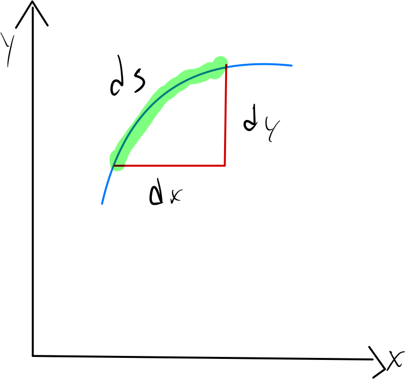

# Arc Length and Line Integrals

## Lengths of Parametric Curves

:::definition "smooth"
A function with a @continuous first derivative is said to be **smooth**.

For a parametrically defined function where $x = f(t), y = g(t)$, both $f'$ and $g'$ must be @continuous.
:::

:::remark
If we think of a curve in a plane, we can think of the arc length differential $ds$ as the "hypotenuse" of small triangles whose sides are $dx$ and $dy$.

This makes

$$ ds = \sqrt{dx^2 + dy^2} $$

and the differential formula for arc length is then:

$$ L = \int ds $$
:::

:::theorem {label: arc-length-in-plane}
If a smooth curve $x = f(t), y = g(t), a \le t \le b$, is traversed exactly once as $t$ increases from $a$ to $b$, the curve's length is

$$ L = \int_a^b ds = \int_a^b \sqrt{ \left ( \frac{dx}{dt} \right )^2 + \left ( \frac{dy}{dt} \right )^2} dt $$

The arc length of curve in $\mathbb{R}^3$ can be defined the same way, assuming $z = h(t)$:

$$ L = \int_a^b ds = \int_a^b \sqrt{ \left ( \frac{dx}{dt} \right )^2 + \left ( \frac{dy}{dt} \right )^2 + \left ( \frac{dz}{dt} \right )^2 } dt $$
:::

:::note
Note that the arc length formula for both 2 and 3 dimensions can be written using vector notation in the more compact form:

$$ L = \int_a^b \left |\vec{r'}(t) \right | dt $$
:::

## Line Integrals

:::note
A line integral is similar to integrating over an interval $[a,b]$, except it allows us to integrate over a curve $C$ (curve integral would be a better name.)
:::

:::definition "Line Integral"
If $f$ is defined on a smooth curve C given by $x = x(t), y = y(t), a \le t \le b$, and $f$ if defined on $C$, then the line integral of $f$ along $C$ is defined as:

$$ \int_C f(x,y) ds = \lim_{n \to \inf} \sum_{i=1}^n f(x_i, y_i) \Delta s_i $$
:::

:::theorem {label: line-integral-over-a-plane-curve}
If $f$ is a continuous function of two variables $x = x(t), y = y(t)$ whose domain includes the smooth curve $C$, then the line integral can be evaluated as:

$$ \int_C f(x,y) ds = \int_a^b f(x(t), y(t)) \sqrt{ \left ( \frac{dx}{dt} \right )^2 + \left ( \frac{dy}{dt} \right )^2} dt $$
:::

:::remark
Line integrals in the $xy$-plane that correspond to integrals in the complex plane take the form

$$ \int_{C} P(x,y)dx + Q(x,y)dy. $$
:::

:::theorem {label: all-parameterizations-of-curve-have-same-line-integral}
When $P(x,y)$ and $Q(x,y)$ are continuous and $C$ is smooth, we can calculate the value of the line integral by expressing $P, Q, dx$ and $dy$ in terms of any parametric representation of $C$ and evaluating the resulting definite integral:

$$ \int_{C} P(x,y)dx + Q(x,y)dy = \int_{\alpha}^{\beta} \left \{ P[x(t), y(t)]\frac{dx}{dt} + Q[x(t), y(t)]\frac{dy}{dt} \right \}dt. \tag{4.7} $$

All parameterizations of the curve lead to the same value.
:::

:::remark
For some integrals, it does not matter what path is taken between two points; the value is always the same. Such line integrals are said to be independent of path.
:::

:::definition "Path Independent" {synonyms: "independent of path"}
We say that line integral 4.7 is **independent of path** in a domain $D$ if for any two points $A$ and $B$ in $D$, the value of the line integral is the same for all piecewise smooth curves in $D$ from $A$ to $B$.
:::

:::remark
There are two ways to ensure that a line integral is independent of path in a domain $D$:

1. Show that $P\mathbf{\hat{i}} + Q\mathbf{\hat{j}}$ is the gradient of some function $\phi(x,y)$ at every point of $D$.

2. If $D$ is simply-connected (every closed curve in $D$ contains in its interior only points of $D$), show that $\partial Q/\partial x = \partial P / \partial y$.
:::

:::theorem {label: fundamental-theorem-of-line-integrals}
When a line integral is known to be independent of path, and its value is required along some curve with initial point $A$ and final point $B$, we can either replace the given curve with a simpler curve, or, take the difference in the values of the function $\phi(x,y)$ at $B$ and $A$.

$$ \int_{C} P(x,y)dx + Q(x,y)dy = \left \{ \phi(x,y) \right \}_{A}^{B} = \phi(x_B, y_B) - \phi(x_A, y_A). $$
:::

:::theorem {label: closed-path-of-path-independent-integral-is-zero}
If a line integral is independent of path in a domain $D$, and $C$ is a closed, piecewise smooth curve in $D$ that contains only points of $D$ in its interior, its value is zero:

$$ \oint_C Pdx + Qdy = 0 $$
:::

:::remark
When a line integral is required around a closed curve, and the line integral is not independent of path, Green's theorem can sometimes be used.
:::

:::theorem "Green's Theorem" {label: greens-theorem}
Suppose $P(x,y)$ and $Q(x,y)$ have continuous first partial derivatives in a domain containing a simple, closed, piecewise smooth curve $C$ and its interior $R.$ Then

$$ \oint_C Pdx + Qdy = \iint_R \left ( \frac{\partial Q}{\partial x} - \frac{\partial P}{\partial y} \right ) dA. $$
:::
