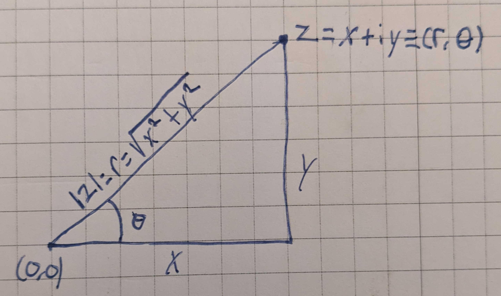

# Algebraic Properties

## Complex Numbers - Basics

A **pure imaginary number** is the product of a real number and a number $i$ which is defined by the relation $i^2 = -1$.

A **complex number** is one which can be written in the form $a + bi$, where a and be are real numbers.

Note that the complex numbers include both the real numbers and the imaginary numbers.

The $a$ in the complex number $z = a + bi$ is called the **real part of z;** the $b$ is called the **imaginary part of z**.

Note that the imaginary part of a complex number is itself real.

If $ z = a +bi$, then the **conjugate of z,** written as $\bar{z}$, is $\bar{z} = a - bi$.

To form the conjugate of a complex number, simply change the sign of the coefficient of $i$.

If $z = a + bi$, then the **absolute value of z** or **modulus of z**, written as $\lvert z \rvert$, is $\lvert z \rvert = \sqrt{a^2 + b^2}$.

In a rectangular coordinate system, we can label the $x$-axis as the real axis and the $y$-axis as the imaginary axis, allowing us to represent any complex number $z = a + bi$ graphically by plotting $a$ along the real ($x$) axis and $b$ along the imaginary ($y$) axis:

This also helps establish relationships between a complex numbe rand the polar coordinates of its point. In the following figure, we have represented graphically the complex number $z = x + iy$ and the polar coordinate $(r, \theta)$ of its point:

This image makes the following relationships obvious:

$$ \lvert z \rvert = r = \sqrt{x^2 + y^2} $$

$$ x = r\cos\theta $$

$$ y = r\sin\theta $$

If we take

$$z = x + yi$$

and call it the **rectangular form of z**, we can replace $x$ and $y$ with their polar equivalents to get:

$$ z = r\cos\theta + ir\sin\theta = r(cos\theta + i\sin\theta) $$

which is called the **polar form of z**.

The polar angle $\theta$ in the figure above is called the **principal argument of z**, written as $\Arg z$, and is defined to be an angle in $(-\pi, \pi]$ satisfying the two equalities:

$$ \cos\theta = \frac{x}{\lvert z \rvert}, \quad \sin\theta = \frac{y}{\lvert z \rvert} $$

or

$$ tan{\theta} = \frac{y}{x}, $$

as long as $x$ is non-zero.

We can use $\Arctan\frac{y}{x}$ to find the principal argument; if $z$ is in the first or fourth quadrants, it gives it directly. If $z$ is in the second quadrant, we must add $\pi$ to $\Arctan\frac{y}{x}$, and if $z$ is in the third quadrant we must subtract $\pi$ from $\Arctan\frac{y}{x}$.

Writing it as $\text{arg}z$ means that instead of taking the **principal value** of $\theta$, we have a multivalued function giving all possible angles satisfying those two equalities:

$$ \text{arg} z = \Argz \pm 2n\pi,~n = 1,2,3 $$

Sometimes, $\text{arg}z$ is taken to mean any argument of $z,$ so that it's still single valued.

When $z = 0$, no argument exists.

When $z = x + yi$ and $x = 0$, the complex number lies on the imaginary axis and is either $\frac{\pi}{2}$ or $-\frac{\pi}{2}$.

We can also write a complex number in **exponential form**, by taking advantage of Euler's formula:

$$ e^{\theta i} = \cos\theta + i\sin\theta. $$

This means we can write a complex number $z$ with $r = \|z\|, \theta = \arg{z}$ as

$$ z = r(\cos\theta + i\sin\theta) = re^{\theta i}. $$

This form makes it super obvious that arguments add and moduli multiply when multiplying complex numbers:

$$ ae^{\theta i} + be^{\phi i} = abe^{(\theta + \phi) i} $$

## Algebra of Complex Numbers

Here are the rules for performing addition, subtraction, multiplication and division with complex numbers. They follow the normal rules of algebra, with the number $i^2$ being replaced by its agreed upon value $-1$. If $z_1 = a + bi$ and $z_2 = c + di$ are two complex numbers, then by definition:

$$ z_1 + z_2 = (a + bi) + (c + di) = (a + c) + (b + d)i \tag{18.6} $$

$$ z_1 - z_2 = (a + bi) - (c + di) = (a - c) + (b - d)i \tag{18.61} $$ 

$$ z_1z_2 = (a + bi)(c + di) = ac + adi + bci + bdi^2 = (ac - bd) + (ad + bc)i \tag{18.62} $$ 

$$ \frac{z_1}{z_2} = \frac{a + bi}{c + di} \cdot \frac{c - di}{c - di} = \frac{(ac + bd) + (bc -ad)i}{c^2 + d^2} = \frac{ac + bd}{c^2 + d^2} +  \frac{bc - ad}{c^2 + d^2}i,\quad c^2 + d^2 \neq 0 \tag{18.63} $$

We get some nice behavior when multiplying complex numbers in polar form due to the following property:

$$ arg(z_1 z_2) = arg(z_1) + arg(z_2) $$

That is, when we multiply numbers complex numbers, we can add their arguments (and multiply their moduli):

$$ z_1 \cdot z_2 = r_1 r_2 (cos(\theta_1 + \theta_2) + isin(\theta_1 + \theta_2)) $$

This can be interpreted geometrically that multiplying by a complex number causes rotation in the complex plane.

We can use this proprety to easily compute powers of complex numbers, which is sometimes called **DeMoivre's theorem**:

:::theorem "de Moivre's Theorem" {label: de-moivres-}
$$ z^n = r^n ( \cos{n\theta} + i \sin{n \theta} ) $$
:::

:::theorem "nth root of z" {label: nth-root-of-z}
For complex $z$ and integer $n,$ with $z = r(\cos{x} + i \sin{x}),$ we have

$$ r^{\frac{1}{n}} \left ( \cos{\frac{x + 2 \pi k}{n}} + i \sin{\frac{x + 2 \pi k}{n}} \right ). $$

:::

## Square Root of Complex Numbers

To find the square roots $z$ of a complex number $Z$ is to solve the following equation for $z$:

$$ Z = z^2. $$

If $X$ and $Y$ are the real and imaginary parts of $Z$ and we let $x$ and $y$ be the real and imaginary parts of $z$, then we have:

$$ X + Yi = (x + yi) = x^2 +2xyi -y^2, $$

from which we can form two equations by equating real and imaginary parts from both sides:

$$ X = x^2 - y^2, \quad Y = 2xy $$

Now we have two equations and two unknowns, and when they are solved, we will have the two square roots of $Z$.

By definition, the **principal square root** of $Z$ is the square root with the nonnegative real part.

## Complex Quadratrics

We can use the quadratic formula to solve quadratics in a complex variable with complex coefficients, that is where

$$ az^2 +bz +c = 0, $$

where $a,$ $b,$ $c,$ and $z,$ are complex; it may require taking the square root of a complex number.

## Exponential, Trigonometric and Hyperbolic Functions of Complex Numbers

Some Maclaurin series expansions for a complex valued $z$:

$$ e^z = 1 + \frac{z}{1!} + \frac{z^2}{2!} + \frac{z^3}{3!} + \cdots \tag{18.73} $$

$$ \sin{z} = z - \frac{z^3}{3!} + \frac{z^5}{5!} + \cdots \tag{18.74} $$

$$ \cos{z} = 1 - \frac{z^2}{2!} + \frac{z^4}{4!} + \cdots \tag{18.75} $$

Interestingly, $\cos{i}$ turns out to be a real number:

$$ \cos{z} = 1 + \frac{1}{2!} + \frac{1}{4!} + \frac{1}{6!}\cdots $$

Using the series expansions above, we can prove the following identities which we will use in this chapter (see the book for proof outlines, full proofs are beyond the scope of the book):

$$ e^0 = 1 \tag{18.8} $$

$$ e^{z_1}e^{z_2} = e^{z_1+z_2} \tag{18.81} $$

$$ e^{iz} = \cos{z} + i\sin{z} \tag{18.82} $$

$$ e^{-iz} = \cos{z} - i\sin{z} \tag{18.83} $$

$$ \sin{z} = \frac{1}{2i}(e^{iz}-e^{-iz}) \tag{18.84} $$

$$ \cos{z} = \frac{1}{2}(e^{iz}+e^{-iz}) \tag{18.85} $$

$$ e^z \neq 0~\text{for any value of z}\tag{18.86} $$

The hyperbolic functions are defined as:

$$ \sinh{z} = \frac{e^z - e^{-z}}{2} \tag{18.9} $$ 

$$ \cosh{z} = \frac{e^z + e^{-z}}{2} \tag{18.91} $$ 

$$ \tanh{z} = \frac{\sinh{z}}{\cosh{z}} = \frac{e^z - e^{-z}}{e^z + e^{-z}} \tag{18.92} $$ 

and are called, respectively, the **hyperbolic sine**, **hyperbolic cosine**, and **hyperbolic tangent** of $z$.

## Proof that imaginary roots of polynomials with real coefficients occur in pairs

(*jmh* my notes, the answers to exercises 18.6 through 18.9.)

First a couple of facts about adding and multiplying conjugates. Assume $z_1 = a + bi$ and $z_2 = c + di$.

Then:

$$ \bar{z}_1 + \bar{z}_2 = (a - bi) + (c - di) = (a + c) - (b + d)i = \overline{(a+c) + (b + d)i} = \overline{(a + bi) + (c + di)} = \overline{z_1 + z_2} \tag{z.1} $$

and

$$ \overline{z_1 z_2} = \overline{(a+bi)(c+di)} = \overline{(ac-bd) + (ad + bc)i} = (ac-bd) - (ad+bc)i = ac - bd - adi - bci = ac - bci - bd - adi = c(a-bi) - di(a - bi) = (a - bi)(c - di) = \bar{z}_1 \bar{z}_ 2 \tag{z.2} $$

Now the main proof follows. Given that $r$ is a root of

$$ a_nx^n + a_{n-1}x^{n-1} + \cdots + a_1x + a_0 = 0 \tag{a} $$

i.e. that the following statement is true:

$$ a_nr^n + a_{n-1}r^{n-1} + \cdots + a_1r + a_0 = 0 \tag{b} $$

and that $a_n$, $a_{n-1}$, ..., $a_0$ are real numbers, we will show that $\bar{r}$ is also a root of (a), that is, that:

$$ a_n\bar{r}^n + a_{n-1}\bar{r}^{n-1} + \cdots + a_1\bar{r} + a_0 = 0 \tag{c} $$

Going back to (b) we can take the conjugate of both sides to get:

$$ \overline{ a_nr^n + a_{n-1}r^{n-1} + \cdots + a_1r + a_0} = \bar{0} = 0 \tag{d} $$

Using (z.1), we can rewrite (d) as:

$$ \overline{ a_nr^n} + \overline{a_{n-1}r^{n-1}} + \cdots + \overline{a_1r} + \overline{a_0} = 0 \tag{e} $$

Using (z.2), we can rewrite (e) as:

$$ \overline{a_n} \cdot \overline{r^n} + \overline{a_{n-1}} \cdot \overline{r^{n-1}} + \cdots + \overline{a_1} \cdot \overline{r} + \overline{a_0} = 0 \tag{f} $$

Again using (z.2) and the fact that $r^n = r \cdot r \cdot r ....$ repeated $n$ times, we can rewrite (f) as:

$$ \bar{a}_n \bar{r}^n + \bar{a}_{n-1} \bar{r}^{n-1} + \cdots + \bar{a}_1 \bar{r} + \bar{a}_0 = 0 \tag{g} $$

Note that since $a_n,~a_{n-1}$ are real numbers, they are complex numbers of the form $a_n + 0i,~a_{n-1} + 0i,...$, and since $a_n+0i = a_n - 0i$ we have:

$$ a_n = \bar{a}_n, a_{n-1} = \bar{a}_{n-1}, ... \tag{g} $$

And therefore we can rewrite (g) as:

$$ a_n \bar{r}^n + a_{n-1} \bar{r}^{n-1} + \cdots + a_1 \bar{r} + a_0 = 0 \tag{h} $$

Which is the statement we wished to prove (c). $\blacksquare$
