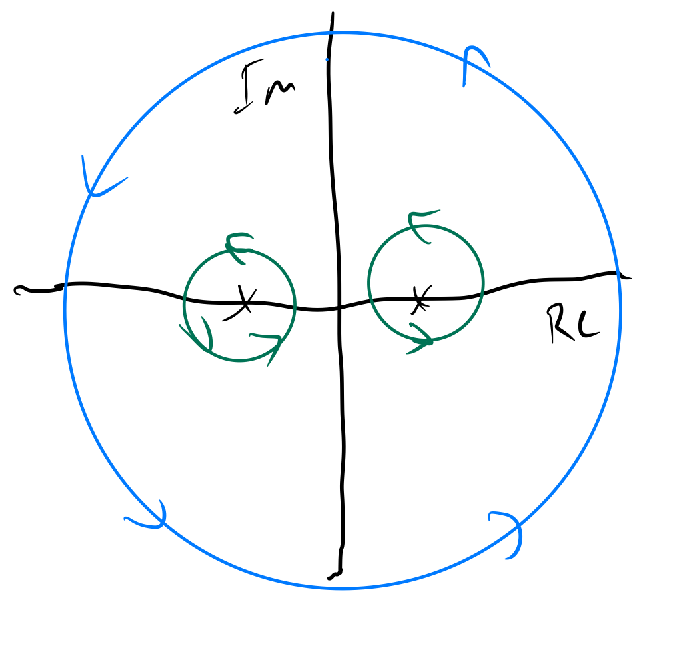

# Cauchy's Integral Theorem
:::theorem "Cauchy's Integral Theorem" {label: @cauchys-integral-theorem}
If $f(z)$ is @analytic in a @simply-connected @domain $D,$ then for every @simple @closed @path $C$ in $D,$

$$ \oint_C f(z) dz = 0. $$

::::proof
Let $f(z) = u(x,y) + i(v,y).$ By the definition of the @contour-integral, we have

$$ \int_{C} f(z) dz = \int_C (u+vi)(dx + dyi) = \int_C ( u dx - vdy ) + i \int_C (vdx + udy). $$

Because $f$ is @analytic, the @cauchy-riemann-equations tell us that $u(x,y)$ and $v(x,y)$ have @continuous first @partial-derivatives, and therefore, we can apply @greens-theorem. Now, we can take the first integral and transform it

$$ \int_C ( u dx + (-vdy) ) = -\iint_R \left ( v_x + u_y \right) dxdy. $$

But, by @cauchy-riemann-equations, $v_x = -u_y,$ so this integral evaluates to $0.$

Now, for the second integral, using @greens-theorem again, we get

$$ i \int_C (vdx + udy) = i\iint_R (u_x - v_y) dxdy, $$

and by @cauchy-riemann-equations, $u_x = v_y,$ so this integral also evaluates to $0,$ which makes the overall integral $0$ as well.
::::
:::

# Cauchy-Goursat Theorem

First, a less general theorem that can be shown using Green's theorem:

:::theorem "Cauchy Integral Theorem" {label: cauchy-integral-theorem}
If the derivative $f'$ of a complex function $f$ is continuous in a domain containing a simple, closed, piecewise smooth curve $C$ and its interior, then

$$ \oint_c f(z) dz = 0. $$
:::

The Cauchy-Goursat Theorem is more general and doesn't require continuity of $f'$:
:::theorem "Cauchy-Goursat Theorem" {label: cauchy-goursat-theorem}
If $f$ is analytic inside and on a closed, piecewise smooth curve $C$, then

$$ \oint_c f(z) dz = 0. $$
:::

:::note
Note that $f$ has to be analytic both on and inside the piecewise smooth curve $C$. This means that if $C$ encloses a singularity, then Cauchy-Goursat can't be applied directly.
:::

In these cases we can apply an extension of Cauchy-Goursat:

:::theorem
Let $C$ be a simple, closed piecewise smooth curve, and $C_1$, $C_2$, $\dots$, $C_n$ be disjoint, simple, closed piecewise smooth curves in the interior of $C$. If $f$ is analytic at all points that are both inside or on $C$, and outside or on each $C_j$, then

$$ \oint_c f(z) dz = \sum_{j=1}^n \oint_{C_j} f(z) dz. $$
:::

This arms us with a method to find the following contour integral:

$$ \oint_C \frac{1}{z^2 - 1}, \quad C : |z| = 4. $$

Since $f(z) = \frac{1}{z^2 - 1}$ has singularities at $-1$ and $1$ that are completely encircled by $C$, it's not obvious whether or not $f$ has an antiderivative along $C$. However, we can apply the theorem above by encircling the singularities:

Now we can find our contour integral by evaluating the contour integrals on paths around our singularities, as these paths are analytic everywhere outside them but inside $C$.

A useful theorem to proceed from here is the following:

:::theorem
If $C$ is a simple, closed, piecewise smooth curve and $z_0$ is interior to $C$, then:

$$ \oint_C \frac{1}{z - z_0} dz = 2 \pi i. $$

::::intuition
See @integral-of-one-over-z-around-unit-circle and consider path independence and the principle of path deformation.
::::
:::

Now, via partial fraction decomposition we have

$$ \oint_C \frac{1}{z^2 - 1} = \frac{1}{2} \oint_C \frac{1}{z-1} - \frac{1}{z+1} dz = \frac{1}{2}\left ( \oint_C \frac{1}{z - 1} dz - \oint_C \frac{1}{z + 1}dz \right ) = \frac{1}{2} \left ( 2 \pi i - 2 \pi i \right ) = 0. $$ 

The following theorems illustrate the nice properties of simply connected domains, where we don't have to deal with singularities or holes:

When $f$ is analytic in a simply-connected domain $D$, the contour integral of $f$ around every closed, piecewise smooth curve in $D$ vanishes.

When $f$ is analytic in a simply-connected domain $D$, the contour integral of $f$ is independent of path in $D$.

When $f$ is analytic in a simply-connected domain $D$, it has an antiderivative therein.
