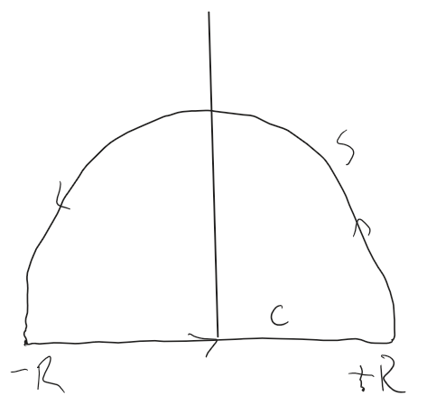
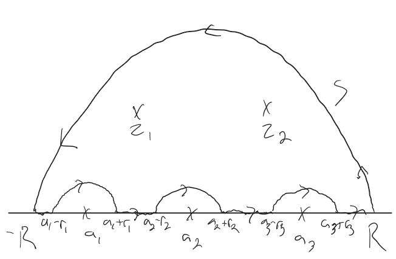

# Real Integrals

There are a few cases where we can use complex contour integrals to simplify finding real valued integrals.

## Full Period Trigonometric Integrals

If we have an integral of the form

$$ I = \int_0^{2 \pi} g(\sin{\theta} \cos{\theta}) d \theta, $$

with a rational function $g$ of $\sin{\theta}$ and $\cos{\theta},$ we can do some magic with a closed contour integral around the unit circle.

We can let $z = e^{i \theta},$ we get

$$ \cos{\theta} = \frac{1}{2}(e^{i \theta} + e^{-i \theta}) = \frac{1}{2} \left ( z + \frac{1}{z} \right ). $$

$$ \sin{\theta} = \frac{1}{2i}(e^{i \theta} - e^{-i \theta}) = \frac{1}{2i} \left ( z - \frac{1}{z} \right ). $$

Additionally,

$$ \frac{dz}{d \theta} = ie^{i \theta}, \quad d \theta = \frac{dz}{iz}, $$

and because our integral ranges from $0$ to $2 \pi,$ the variable $z = e^{i \theta}$ ranges counterclockwise once around the unit circle, so our integral becomes

$$ J = \oint_{|z|} f(z) \frac{dz}{iz}. $$

We then can proceed with a normal contour integral, using @residue methods to deal with any singularities enclosed by the contour.

We can use this technique to prove the following theorem

:::theorem
$$
\int_{0}^{2\pi} \frac{a}{\,b - c\sin\theta\,}\,d\theta
=
\int_{0}^{2\pi} \frac{a}{\,b - c\cos\theta\,}\,d\theta
=
\frac{2\pi a}{\sqrt{b^{2}-c^{2}}}, \qquad b^{2} > c^{2}.
$$
:::

## Improper Integrals

This method applies for integrals of the form

$$ \int_{-\infty}^{\infty} f(x) dx, $$

where $f(x)$ is a @rational-function. It can also be used with integrals of the form

$$ \int_0^{\infty} f(x) dx $$

where $f(x)$ is both @rational and @even.

As an example, let's look at

$$ I = \int_0^{\infty} \frac{1}{1 + x^4} dx = \frac{1}{2} \int_{-\infty}^{\infty} \frac{1}{1 + x^4} dx. \tag{a} $$

We can solve this real integral by looking at the complex contour integral

$$ J = \frac{1}{2} \oint_C \frac{1}{1 + z^4} dz, $$

with $C$ being the upper half-circle closed along the $x$-axis:

Here, $C$ is the entire contour, and the part labeled $S$ is the upper half-circle.

The key concept is that if we rewrite (a) as

$$ I = \lim_{R \to \infty} \frac{1}{2} \int_{-R}^{R} \frac{1}{1 + x^4} dx, $$

then the semi-circle grows to enclose the entire upper half-plane. If the value of the complex contour integral along $S$ goes to $0$ as $R$ goes to infinity, then the contour integral is equivalent to the integral along the real axis, and we can use @residue methods to compute it, accounting for any singularities in the upper half-plane.

In order for $\oint_S f(z) dz$ to approach $0$ as $R \to \infty,$ a sufficient condition is that the denominator of $f(x)$ has a power of $x$ at least two degrees higher than the numerator, which applies in our case.

Now, $z^4 + 1$ has 4 zeros, but only two of them, $z_1 = e^{i \pi / 4}$ and $z_2 = e^{i 3 \pi / 4}$ occur in our semi-circle (i.e. they are in the upper half plane).

Using the @residue-theorem, we have then that

$$ I = \frac{1}{2} * 2 \pi i * (\Res{z \to z_1}f(z) + \Res{z \to z_2}f(z)) = \frac{\sqrt{2}}{4} \pi. $$

Putting this all together, we have, in general, with the conditions specified,

$$ \int_{-\infty}^{\infty} f(x) dx = 2 \pi i \sum \Res f(z). $$

## Improper Integrals with Simple Poles on the Real Axis

:::definition "Cauchy Principal Value"
Let's say we have an integral

$$ \int_A^{B} f(x) dx \tag{a} $$

whose integrand becomes infinite at a point $a$ in the interval of integration.

Then, (a) means, by definition

$$ \int_A^{B} f(x) dx = \lim_{\epsilon \to 0} \int_A^{a - \epsilon} f(x) dx + \lim_{\eta \to 0} \int_{a + \eta}^{B} f(x) dx. $$

However, it may be the case that neither limit exists when both $\epsilon$ and $\eta$ approach $0$ independently, but that the limit

$$ \lim_{\epsilon \to 0} \left [ \int_A^{a - \epsilon} f(x) dx +  \int_{a + \epsilon}^{B} f(x) dx \right ] $$

does exist.

This @limit is called the **Cauchy principal value** of the integral and is written as

$$ \text{pr. v. } \int_A^{B} f(x) dx. $$
:::

This principal value can exist, although the integral itself is undefined. We can use this for the following theorem in the case there are @simple @poles on the real axis and we have an integral from $-\infty$ to $\infty.$

:::theorem "Simple Poles on the Real Axis"
If $f(z)$ has a @simple @pole at $z = a$ on the real axis, then

$$ \lim_{r \to 0} \int_{C_2} f(z) dz = \pi i \Res{z=a} f(z), $$

as illustrated below

:::

Putting this all together, we get, for an integral that has poles off of the real axis and simple poles on the real axis, we get

$$ \text{pr. v. } \int_{- \infty}^{\infty} f(x) dx = 2 \pi i \sum \Res f(z) + \pi i \sum \Res f(z), $$

where the first sum covers all the poles in the upper half-plane and the second over all the poles on the real axis (which must be simple.

For example, given the situation illustrated below:

we have

$$ \text{pr. v. } \int_{- \infty}^{\infty} f(x) dx = 2 \pi i \left ( \Res_{z \to z_1}f(z) + \Res_{z \to z_2}f(z) \right )  + \pi i \left (  \Res_{z \to a_1}f(z) + \Res_{z \to a_2}f(z) + \Res_{z \to a_3}f(z) \right ). $$

