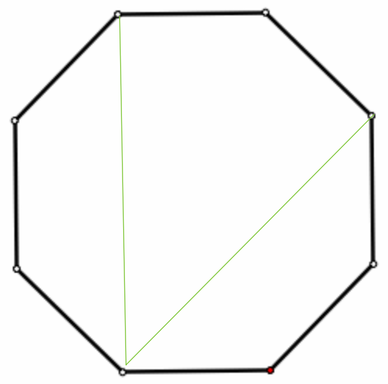

# Standardized Test Math

These are some notes from my preperation for a standardized math test.

## Geometry

### Interior Angles of Regular Polygons

The sum of the degrees of the interior angles of a regular $n$-gon is $180(n - 2)$. This can be shown by dividing the interior into triangles by picking one vertex and drawing diagonals to non opposing vertices. There will be $n-3$ non-adjacent vertices, resulting in $n-2$ triangles, each with $180$ degrees of interior angles.

### Diagonals in a Regular Octagon

How many diagonals does a regular octagon have? How many of them are parallel to at least one side of the octagon?

There are $n$ vertices in a regular $n$-gon; each vertex is an endpoint for $n-3$ diagonals. However, each diagonal connects to two vertices, so we end up with $\frac{n(n-3)}{2}$ diagonals in a regular $n$-gon. Therefore, a regular octagon has $20$ diagonals.

We can exploit the symmetry of an octagon to get our answer from here. The image below shows that any given vertex is connected to two diagonals that are parellel to at least one side.

There are 8 vertices, and each diagonal connects to two diagonals that are parallel to at least one side, so we have $\frac{8 \cdot 2}{2} = 8$ diagonals that are parallel to at least one side of the octagon.

*Note:* I'm not sure how to generalize this to $n$-gons. In particular, I'm not sure how to find the number of diagonals parallel to at least one side.

## Series

Find the sum

$$ \sum_{n=1}^{100}{\frac{1}{n} - \frac{1}{n+1}}.$$

We can split the summation into two:

$$ \sum_{n=1}^{100}{\frac{1}{n} - \frac{1}{n+1}} = \sum_{n=1}^{100}{\frac{1}{n}} -  \sum_{n=1}^{100}{\frac{1}{n+1}}. $$

Now, it's helpful to write out some terms:

$$ \begin{align} \sum_{n=1}^{100}{\frac{1}{n}} & = \frac{1}{1} + \frac{1}{2} + \frac{1}{3} + \cdots + \frac{1}{99} + \frac{1}{100} \\  \sum_{n=1}^{100}{\frac{1}{n+1}} & = \frac{1}{2} + \frac{1}{3} + \frac{1}{4} + \cdots + \frac{1}{100} + \frac{1}{101} \end{align}. $$

From this, it's obvious that subtracting the second summation from the first cancels out all terms except the $\frac{1}{1}$ unique to the first summation and the $\frac{1}{101}$ unique to the second summation.

$$ \require{cancel} $$ 

$$ \begin{align} \sum_{n=1}^{100}{\frac{1}{n}} & = \frac{1}{1} + \cancel{\frac{1}{2} + \frac{1}{3} + \cdots + \frac{1}{99} + \frac{1}{100}} \\  \sum_{n=1}^{100}{\frac{1}{n+1}} & = \cancel{\frac{1}{2} + \frac{1}{3} + \frac{1}{4} + \cdots + \frac{1}{100}} + \frac{1}{101} \end{align}. $$

So, we end up with

$$ \sum_{n=1}^{100}{\frac{1}{n} - \frac{1}{n+1}} = 1 - \frac{1}{101} = \frac{100}{101}. $$

## Algebra

### Number of Matches Won

During the first half of the year, a tennis player won 60 percent of the matches she played in. During the second half, the player won 3 out of the 20 matches she played in. If the tennis player won 50 percent of the matches she played in for the year, how many matches did she play in?

Since we know that there were 20 matches played in the second half, our unknown is the number of matches played in the first half. Let's call that $x$.

Then

$$ 0.6x + 3 = 0.5(x + 20), $$

because the left hand side represents the number of matches won in the first and second half of the season, and the right hand side the number of matches won overall.

Solving for $x$, we get $x = 70.$ Then, the number of matches played for the entire year is $70 + 20 = 90$.

### Which Quantity is Odd?

if $x$ and $y$ are integers and $x = 50y + 69$, which of the following must be odd, what is a non-trivial linear combination of $x$ and $y$ that is odd?

We can show that $x$ must be odd by considering a couple of cases. If $y$ is odd, $50y + 69 = 50(2n + 1) + 69 = 100n + 50 + 69 = 100n + 119$, which is odd. If $y$ is even, $50y = 50(2n) + 69 = 100n + 69$, which is also odd. Therefore, $x$ must be odd.

We don't know if $y$ is odd or even. However, consider $x + 2y$. If $y$ is even, then $x + 2y$ = $2m + 1 + 2(2n) = 2(m + 2n) + 1$, which is odd. If $y$ is odd, then $x + 2y = 2m+1 2(2n+1) = 2(m+2n+1) + 1$, which is also odd. Therefore, $x + 2y$ is a non-trivial linear combination of $x$ and $y$ that is odd.

### Chained Inequality

Given $p, q, r$ are positive integers such that $3p < 2q < 4r$, which of the following could be true?

$$ \begin{align} p &= q \\  q &= r \\ q &> r  \\ p &> r. \end{align} $$

We can consider each case.

Assume $p = q$. Then we have $3p < 2p < 4r$, which is a contradiction, since $p$ is a positive integer. Therefore, $p$ can't equal $q$.

Assume $q = r$. Then we have $3p < 2q < 4q$, which is true for $p = 1, q = 2$, so $q = r$ can be true.

Next, $q > r$ is true when $p = 1, q = 3, r = 2$, and we have $3 < 6 < 8$, so $q > r$ can be true.

Finally, $p > r$ is true when $p = 7, q = 11, r = 6$, and we have $21 < 22 < 24$, so $p > r$ can be true. We can head this way by considering that $3x < 4z \iff x < \frac{4}{3}z$, and $3x < 2y \iff \frac{3}{2}x < y$, and $2y < 4z \iff y < 2z$. Then we can pick a $z$ and find $x$ and $y$ that satisfy those constraints. It turns out $6$ is the smallest $z$ that this works for, but $z=10$ also works, with $x=11$ and $y=17$.
