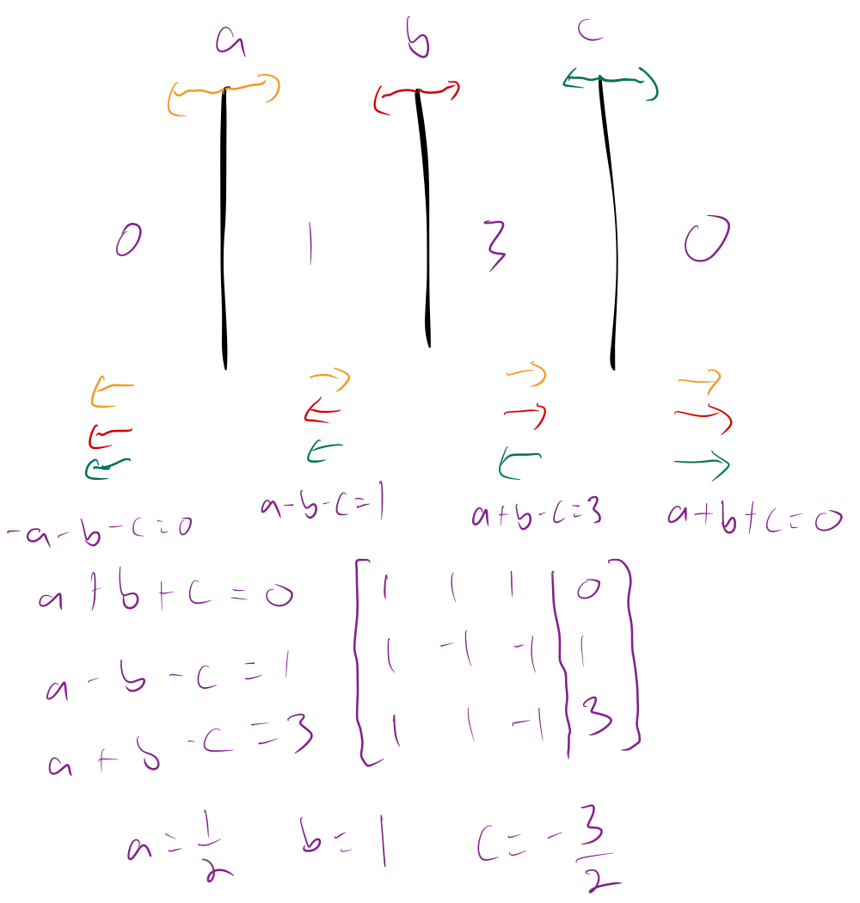

# Gauss's Law

The electric flux $\Phi$ through a surface is the amount of electric field that pierces the surface. In this context, when we speak of a surface, especially a Gaussian surface, we are speaking of a conceptual surface, i.e. a connected set of points in space, not a physical surface (although a Gaussian surface can coincide with a physical surface.) Typically the surface is in a convenient way to solve a problem or provide insight. 

Electric flux through a surface is defined by the dot product of the electric field vector $\vec{E}$ and the area vector $\vec{A}$:

$$ \Phi = \vec{E} \cdot \vec{A} $$

The area vector is a vector normal to a surface with a magnitude equal to the area of a surface.

In the simplest case where the electric field is uniform and perpendicular to a flat surface, the electric flux is simply the product of the electric field magnitude and the area of the surface:

$$ \Phi = E \times A $$

However, if the electric field is not perpendicular to the surface or if the surface is curved, the calculation integrates the electric field over the surface:

$$ \Phi = \int_S \vec{E} \cdot d \vec{A} $$

The net flux through a closed surface is given by:

$$ \Phi = \oint_S \vec{E} \cdot d \vec{A} $$

Gauss' law relates the electric field at points on a (closed) Gaussian surface to the net charge enclosed by that surface. It is one of Maxwell's equations. An inward piercing field is negative flux. An outward piercing field is positive flux. A skimming field is zero flux.

Gauss' law relates the net flux $\Phi$ penetrating a closed surface to the net charge $q_{enc}$ enclosed by the surface:

$$ \epsilon_0 \Phi = q_{enc} $$

Gauss' law can also be written in terms of the electric field piercing the enclosing Gaussian surface:

$$ \epsilon_0 \oint \vec{E} \cdot d \vec{A} = q_{enc} $$ 

$$ \oint \vec{E} \cdot d \vec{A} = \frac{q_{enc}}{\epsilon_0} $$ 

For a uniform field and a flat surface where the angle between the normal of the surface and the field is $\theta$ we have

$$ \Phi = (E\cos\theta)A $$

Gauss's law applies universally, but the math is made much simpler whenever we can exploit symmetry to simplify the situation.

Some common types of symmetry are:

* Spherical symmetry

* Cylindrical symmetry

* Planar symmetry

For example, we can use Gauss's law and spherical symmetry to derive Coulomb's law.

Consider at point charge $Q$ located at a point in space. Assume a spherical Gaussian surface of radius $r$ is centered at the point charge. Symmetry ensures that the electric field $E$ at any point on the surface is radially directed and has the same magnitude everywhere on the surface.

The total flux through the spherical surface is the product of the electric field and the area of the sphere:

$$ \oint_s \vec{E} \cdot d\vec{A} = E \times 4 \pi r^2 $$

According to Gauss's Law, $E \times 4 \pi r^2 = \frac{Q}{\epsilon_0} $$

Solving for $E$ gives

$$ E = \frac{Q}{4 \pi \epsilon_0 r^2} $$

This is the magnitude of the electric field at distance $r$ from a point charge $Q$, directed radially. Adding direction and applying the electric field to a test charge $q_0$ we get

$$ \vec{F} = \frac{1}{4\pi\epsilon_0} \frac{Qq_0}{r^2}\hat{r}, $$

which is Coulomb's law.

The electric field at a point near an infinite line of charge (or charged rod) with uniform density $\lambda$ is perpendicular to the line and has magnitude

$$ E = \frac{\lambda}{2 \pi \epsilon_0 r} $$

where $r$ is the perpendicular distance from the line to the point.

The electric field due to an infinite nonconducting sheet with a uniform surface charge density $\sigma$ is perpendicular to the plane of the sheet and has a magnitude of

$$ E = \frac{\sigma}{2 \epsilon_0} $$

The external electric field just outside the surface of an isolated charged conductor with charge density $\sigma$ is perpendicular to the surface and has magnitude of

$$ E = \frac{\sigma}{\epsilon_0} $$

Here is an example problem

Here we have large, parallel, uniformly charged non-conducting (plastic) sheets. For these purposes, consider the sheets to be infinitely large, so that the magnitude of the electric field produced by each sheet is constant at any distance.

For this problem, the charge of each sheet is unknown, but the ratio of the magnitude of the electric field is shown below in purple between each sheet.

That is, on the outside of the sheets there is no electric field, and the magnitude of the electric field between sheets b and c is 3 times that of the electric field between a and b.

The key thing to consider when solving this problem is that electric fields follow the principle of superposition, i.e. they combine linearly. Since each sheet generates a field of the same magnitude on each side of it, we can take the quantity in the leftward direction as negative and the quantity in the rightward direction as positive.

Then, to the left of all the sheets, each sheet contributes to the net electric field in the negative direction. Between sheets a and b, a contribtues in the positive direction and b and c contribute in the negative direction. Between sheets b and c, a and b contribute in the positive direction and c contributes in the negative direction, and finally, to the right of all the sheets, all sheets contribute in the positive direction. In the image above, this is indicated by the directions of the stacks of arrows below and between the sheets.

Because the strength of electric field is proportional to the charge of each sheet, with the same constant of proportionality in each case, we can solve for the ratio of charges on the sheets by setting up a system of linear equations relating the unknown charges to the ratios of the electric fields. Solving gives us the ratios of the charges, showing that if the charge of b is $1$, the charge of a is $1/2$ and the charge of c is $-3/2$.