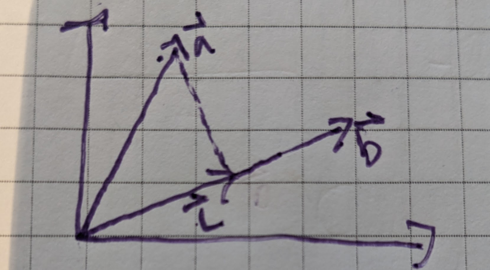

*jmh: my notes*

This lesson starts by discussing a few problems for finding families of curves with some property relating to tangets to points on the curve. Differential equations arise here because the slope of the tangent line in these cases is $y'$.

We need some stuff from algebra, Calculus 3 and linear algebra here.

I'll list some of the useful formulas.

**Midpoint Formula**
The mid-point formula for two points $(x_1, y_1)$ and $(x_2,y_2)$ is:

$$ (\frac{x_1+x_2}{2},\frac{y_1 + y_2}{2}) $$

**Projection**

A projection of $\vec{a}$ onto $\vec{b}$ is a new vector $\vec{c}$ in the direction of $\vec{b}$ representing the portion of $\vec{a}$ that's in the direction of $\vec{b}$. Geometrically, we can find $\vec{b}$ by drawing a line perpindicular to $\vec{b}$ passing through the end of $\vec{a}$. Where this line intersects $\vec{b}$ will be the end of $\vec{c}$

