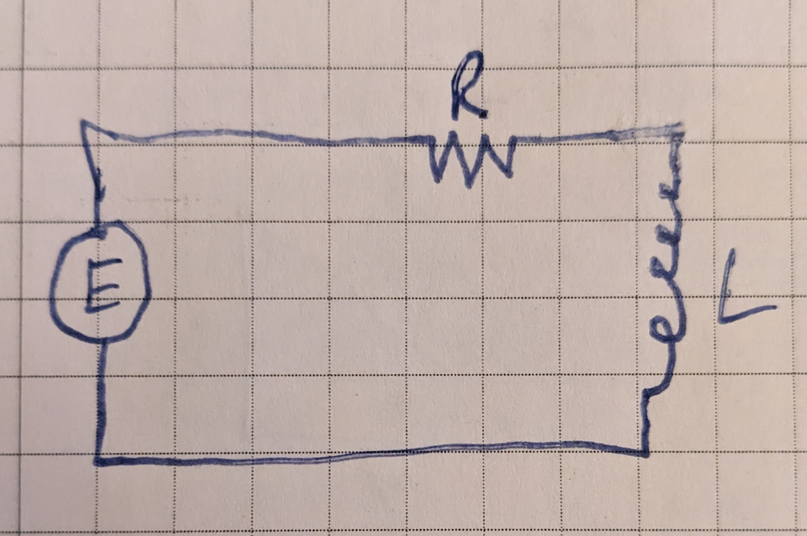

## First Order Linear Electric Circuit

Take a circuit where an applied electromotive force $E$, an inductor $L$ and a resistor are connected in series:

The differential equation describing change in current over time is:

$$ L\frac{di}{dt} + Ri = E \tag {17.63} $$

(*jmh*: my notes)

The above form is convenient for solving because it's in the form of a linear first order differential equation. It says that the electromotive force equals the inductance times the change in current with respect to time plus the current times the resistance.

We could rearrange it to say:

$$ \frac{di}{dt} = \frac{E}{L} - \frac{Ri}{L} $$

Which says that the current changes over time by decreasing proportionally to the current current (hiyo) while growing by the electromotive force divided by the inductance.

The equation can be solved as a linear first order differential equation. This is straightforward and takes only a few steps when the emf is constant, resulting in the solution (for $t=0$, $E=E_0, i=i_0$):

$$ i = \frac{E_0}{R}(1 - e^{\frac{-Rt}{L}}) + i_0 e^{\frac{-Rt}{L}} $$

When emf varies sinusoidally with time the solution takes more work and is ($\omega$ represents the frequency of the sinusoidal wave):

$$ i = \frac{E_0 (R \sin{(\omega t)}-L \omega \cos{(\omega t)} + L\omega e^{\frac{-Rt}{L}})}{\omega^2 L^2 + R^2} + i_0 e^\frac{-Rt}{L} $$

This [desmos link](https://www.desmos.com/calculator/tzigt2uc7x) has graphs of the solutions when the emf is constant (DC) or varying sinusoidally with time (AC).  

Some interesting things to note:

* For constant $E$, $L$ and $R$:
   * We get a steady state current when the current grows enough that current loss caused by resistance equals the current growth caused by emf.
   * This is makes the steady state current a sort of "terminal current" just like terminal velocity is the steady state where acceleration from gravity equals deceleration from air resistance.
* Increasing resistance reduces the peak current for both the DC and AC scenarios
* Increasing inductance decreases the rate of change of current for both DC and AC scenarios.
    * For DC, this slows the ramp up/ramp down to the steady state current, which is $\frac{E}{R}$.
    * For the AC circuit, the slower current change that comes from increasing inductance has the effect of reducing the peak current. This makes sense since the current is changing more slowly, it has less time to change before the voltage alternates and starts pushing the current back in the other direction.
    * The lag in current change caused by the inductance brings the current out of phase with the emf. This is what results in the lower peak currents and is known as inductive reactance. Increasing inductance you can see that the current ends up being a quarter of a cycle behind the voltage. 
* Decreasing inductance to near zero makes the DC circuit behave closer and closer to the ideal of Ohm's law: $i = \frac{E}{R}$
