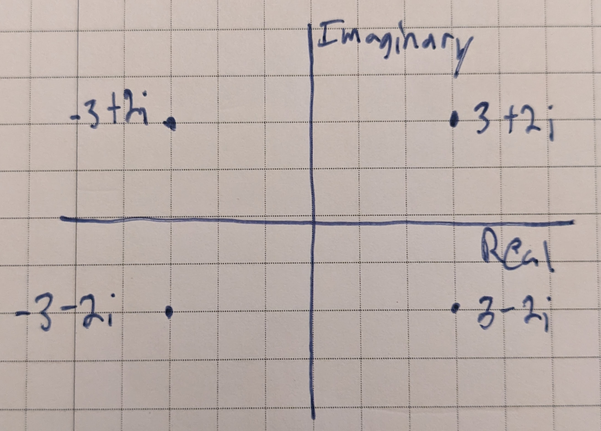
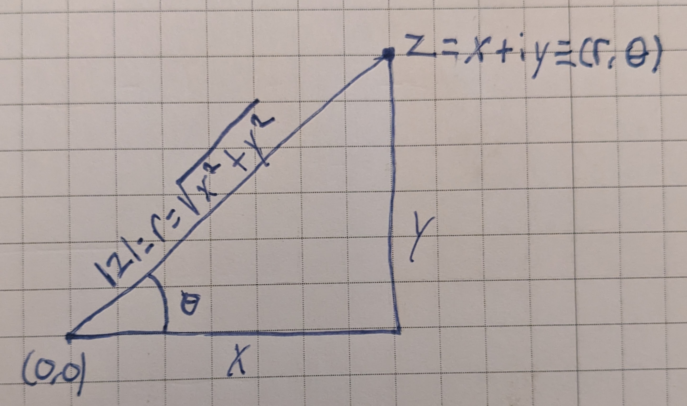

# Complex Numbers

## Complex Numbers - Basics

A **pure imaginary number** is the product of a real number and a number $i$ which is defined by the relation $i^2 = -1$.

A **complex number** is one which can be written in the form $a + bi$, where a and be are real numbers.

Note that the complex numbers include both the real numbers and the imaginary numbers.

The $a$ in the complex number $z = a + bi$ is called the **real part of z;** the $b$ is called the **imaginary part of z**.

Note that the imaginary part of a complex number is itself real.

If $ z = a +bi$, then the **conjugate of z,** written as $\bar{z}$, is $\bar{z} = a - bi$.

To form the conjugate of a complex number, simply change the sign of the coefficient of $i$.

If $z = a + bi$, then the **absolute value of z**, written as $\lvert z \rvert$, is $\lvert z \rvert = \sqrt{a^2 + b^2}$.

In a rectangular coordinate system, we can label the $x$-axis as the real axis and the $y$-axis as the imaginary axis, allowing us to represent any complex number $z = a + bi$ graphically by plotting $a$ along the real ($x$) axis and $b$ along the imaginary ($y$) axis:

This also helps establish relationships between a complex numbe rand the polar coordinates of its point. In the following figure, we have represented graphically the complex number $z = x + iy$ and the polar coordinate $(r, \theta)$ of its point:

This image makes the following relationships obvious:

$$ \lvert z \rvert = r = \sqrt{x^2 + y^2} $$

$$ x = r\cos\theta $$

$$ y = r\sin\theta $$

If we take

$$z = x + yi$$

and call it the **rectangular form of z**, we can replace $x$ and $y$ with their polar equivalents to get:

$$ z = r\cos\theta + ir\sin\theta = r(cos\theta + i\sin\theta) $$

which is called the **polar form of z**.

The polar angle $\theta$ in the figure above is called the **Argument of z**, written as $\text{Arg} z$, and is defined to be the smallest positive angle satisfying the two equalities:

$$ \cos\theta = \frac{x}{\lvert z \rvert}, \quad \sin\theta = \frac{y}{\lvert z \rvert} $$

Writing it as $\text{arg}z$ means that instead of taking the smallest or **principal value** of $\theta$, we have a multivalued function giving all possible angles satisfying those two equalities:

$$ \text{arg} z = \text{Arg}z \pm 2n\pi,~n = 1,2,3 $$

## Exponential, Trigonometric and Hyperbolic Functions of Complex Numbers

Some Maclaurin series expansions for a complex valued $z$:

$$ e^z = 1 + \frac{z}{1!} + \frac{z^2}{2!} + \frac{z^3}{3!} + \cdots \tag{18.73} $$

$$ \sin{z} = z - \frac{z^3}{3!} + \frac{z^5}{5!} + \cdots \tag{18.74} $$

$$ \cos{z} = 1 - \frac{z^2}{2!} + \frac{z^4}{4!} + \cdots \tag{18.75} $$

Interestingly, \cos{i} turns out to be a real number:

$$ \cos{z} = 1 + \frac{1}{2!} + \frac{1}{4!} + \frac{1}{6!}\cdots $$

Using the series expansions above, we can prove the following identities which we will use in this chapter (see the book for proof outlines, full proofs are beyond the scope of the book):

$$ e^0 = 1 \tag{18.8} $$

$$ e^{z_1}e^{z_2} = e^{z_1+z_2} \tag{18.81} $$

$$ e^{iz} = \cos{z} + i\sin{z} \tag{18.82} $$

$$ e^{-iz} = \cos{z} - i\sin{z} \tag{18.83} $$

$$ \sin{z} = \frac{1}{2i}(e^{iz}-e^{-iz}) \tag{18.84} $$

$$ \cos{z} = \frac{1}{2}(e^{iz}+e^{-iz}) \tag{18.85} $$

$$ e^z \neq 0~\text{for any value of z}\tag{18.86} $$

The hyperbolic functions are defined as:

$$ \sinh{z} = \frac{e^z - e^{-z}}{2} \tag{18.9} $$ 

$$ \cosh{z} = \frac{e^z + e^{-z}}{2} \tag{18.91} $$ 

$$ \tanh{z} = \frac{\sinh{z}}{\cosh{z}} = \frac{e^z - e^{-z}}{e^z + e^{-z}} \tag{18.92} $$ 

and are called, respectively, the **hyperbolic sine**, **hyperbolic cosine**, and **hyperbolic tangent** of $z$.