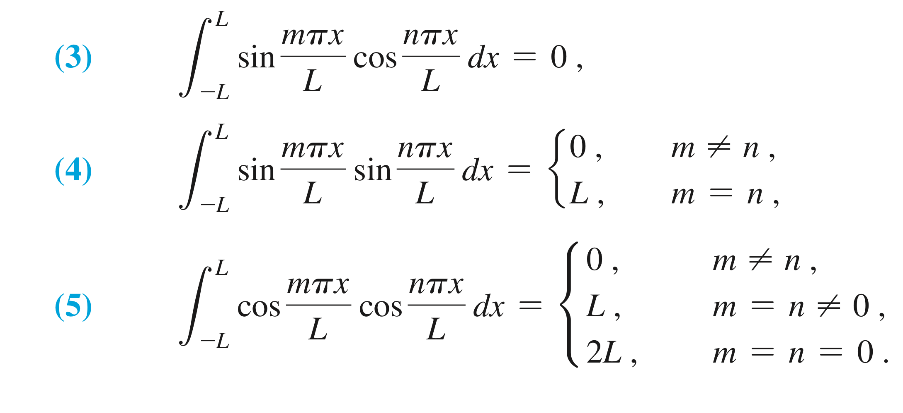

# Review

**Periodic Functions**: A function is **periodic of period** $T$ if $f(x + T) = f(x)$ for all $x$ in the domain of $f$.

**Even Functions**: A function that satisfies $f(-x) = f(x)$ for all $x$ in the domain of $f$ has a graph that is symmetric with respect to the $y$-axis. We say such a function is **even**. The functions $1, x^2, x^4,\dots$ are examples of even functions, as is $\cos{x}$.

**Odd Functions**: A function $f$ that satisfies $f(-x) = -f(x)$ for all $x$ in the domain of $f$ has a graph that is symmetric with respect to the origin. It is said to be an **odd** function. The functions $x, x^3, x^5, \dots$ are examples of odd functions, as are $\sin{x}$ and $\tan{x}$.

Knowing these properties can be useful when evaluating indefinite integrals.

If $f$ is an even piecewise continuous function on $[-a, a]$, then

$$ \int_{-a}^{a} f(x) dx = 2 \int_0^{a} f(x) dx. $$

if $f$ is an odd piecewise continuous function on $[-a, a]$, then

$$ \int_{-a}^{a} f(x) dx = 0. $$

# Some Important Integrals

The following three integrals are crucial in Fourier series. In each, $m$ and $n$ are nonnegative integers.

The first integral:

$$ \int_{-L}^{L} \sin{\frac{m \pi x}{L}} \cos{\frac{n \pi x}{L}} dx. \tag{a} $$

We can simplify this using the trig identity for products of sines and cosines, $\sin{(a)}\cos{(b)} = \frac{1}{2}(\sin{(a - b)} + \sin{(a+b)}):$

$$ \frac{1}{2}  \int_{-L}^{L} \sin{\frac{(m-n) \pi x}{L}} + \sin{\frac{(m+n)\pi x}{L}} dx. $$

Since this is an integral from $-L$ to $L$ over an odd function, it, and thus $(a),$ always equals 0.

The second integral:

$$ \int_{-L}^{L} \sin{\frac{m \pi x}{L}} \sin{\frac{n \pi x}{L}} dx. \tag{b} $$

This time we use the trig identity $\sin{(a)}\sin{(b)} = \frac{1}{2}(\cos{(a - b)} - \cos{(a+b)}):$

$$ \frac{1}{2}  \int_{-L}^{L} \cos{\frac{(m-n) \pi x}{L}} - \cos{\frac{(m+n)\pi x}{L}} dx. \tag{b.1} $$

Here, we have to consider two cases, $m = n$ and $m \neq n$. If $m = n$, $(m-n) = 0, (m+n) = 2m$; also note that this integral is over an even function from $-L$ to $L$, so (b.1)

$$ \frac{1}{2}  \int_{-L}^{L} 1 - \cos{\frac{2m \pi x}{L}} dx = L - \left ( \frac{L\sin{\frac{2m \pi x}{L}}}{2 \pi m} \right)_0^L = L - \left ( \left (\frac{L\sin{2m \pi}}{2 \pi m} \right) - 0 \right ) = L. \tag{b.2} $$

The final $\sin$ in (b.2) is always $0$ because $\sin{2 m \pi}$ for integer $m$ is always $0$. So, when $m = n$, (b) evaluates to $L$.

When $m \neq n$, we can't simplify either $\cos$ in the integrand and end up with two $\sin$'s that are always 0, so when $m \neq n$, (b) evaluates to $0$.

The third integral:

$$ \int_{-L}^{L} \cos{\frac{m \pi x}{L}} \cos{\frac{n \pi x}{L}} dx. \tag{c} $$

This time we use the trig identity $\cos{(a)}\cos{(b)} = \frac{1}{2}(\cos{(a - b)} + \cos{(a+b)}):$

$$ \frac{1}{2}  \int_{-L}^{L} \cos{\frac{(m-n) \pi x}{L}} + \cos{\frac{(m+n)\pi x}{L}} dx. \tag{c.1} $$

Here, we need to consider 3 cases:  $m \neq n$; $m = n, m,n \neq 0$; $m = n = 0$. The first two cases work out just like (b), and when $m \neq n$ we get 0, when $m = n$ but $m$ and $n$ are non-zero we get $L$.

However, when $m = n = 0$, both $\cos$ in the integrand end up as $\cos0 = 1$, and so the integral simplifies to:

$$ \int_{-L}^{L} dx = 2L. \tag{c.2} $$

Thus, when $m = n = 0$, (c) evaluates to 2L.

The following table (from "Differential Equations and Boundary Value Problems", Nagle, et al, 2017, p574) summarizes these integrals nicely:

# Fourier Series

**Definition**: Let $f$ be a piecewise continuous function on the interval $[-L, L]$. The **Fourier Series** of $f$ is the trigonometric series

$$ f(x) \sim \frac{a_0}{2} + \sum_{n=1}^{\infty} \left \{ a_n \cos{\frac{n \pi x}{L}} + b_n \sin{\frac{n \pi x}{L}} \right \}, \tag{8} $$ 

where the $a_n$'s and $b_n$'s are given by the formulas:

$$ a_n = \frac{1}{L} \int_{-L}^{L} f(x) \cos{\frac{n \pi x}{L}} dx, \quad n = 0, 1, 2, \dots, \tag{9} $$

$$ b_n = \frac{1}{L} \int_{-L}^{L} f(x) \sin{\frac{n \pi x}{L}} dx, \quad n = 0, 1, 2, \dots, \tag{10} $$

Formulas (9) and (10) are called the **Euler-Fourier formulas**. The $\sim$ symbols in (8) means that the series is associated with $f(x)$ but may not converge to $f(x)$.

## Example 1

Find the Fourier series for $f(x) = \|3x\|$, $-\pi < x < \pi$.

Here, $L$ = $pi$. We get lucky here because $\|3x\|$ is even, so all $b_n$ terms are 0 (if it were odd, all $a_n$ terms would be 0). First, we'll find $a_0$ using (8). Since $f(x)$ is even, we simplify and integrate over just the positive half and double the result:

$$ a_0 = \frac{1}{\pi} = \int_{-\pi}^{\pi} |3x| dx = \frac{6}{\pi} \int_{0}^{\pi} x dx = 3 \pi. $$

Now, we find $a_n$ using (8), again taking advantage of our integrand being even, and then using integration by parts:

$$ a_n = \frac{1}{\pi} \int_{-\pi}^{\pi} |3x|\cos{(nx)}dx = \frac{6}{\pi} \int_{0}^{\pi} x \cos{nx} dx = \frac{6}{\pi n^2}((-1)^n - 1). $$

Now, using (9) we can write our Fourier series:

$$ |3x| \sim \frac{3\pi}{2} + \sum_{n=1}^{\infty} \left ( \frac{6}{\pi n^2} \left ( (-1)^n - 1 \right ) \cos{(nx)}  \right ) $$

The first few terms are:

$$ |3x| \sim \frac{3 \pi}{2} - \frac{12}{\pi}\cos{x} - \frac{12}{9 \pi}\cos{3x} - \frac{12}{25\pi}\cos{5x} - \cdots $$

## Extensions

If we have a function $f(x)$ that is defined on $0 < x < L$, and we recall that an odd function defined on $[-L, L]$ has only sine terms, we might wish to construct an artificial extension of $f(x)$ onto $(-L, L)$ in such a way that the extended function is odd, so we could construct a Fourier series for the function that consists only of sine terms. We can accomplish this by defining the function

$$ f_o(x) \mathrel{\vcenter{:}}= \begin{cases} 

f(x), & 0 < x < L, \\

-f(-x), & -L < x < 0, \end{cases} $$

and extending $f_o(x)$ to all $x$ using $2L$-periodicity (well, all $x$ other than integer multiples of $L$). Since $f_o(x)$ is odd, its Fourier series will contain only sine terms, and since $f_o(x) = f(x)$ on $(0, L),$ $f_o(x)$ is an extension of $f(x)$. Specifically, it's called the **odd 2L-periodic extension** of $f(x).$ The resulting Fourier series expansion is called a half-range expansion for $f(x),$ since it represents the function $f(x)$ on $(0, L,)$ which is half the interval $(-L, L)$ where it represents $f_o(x).$

Similarly, we can define the **even 2L-periodic extension** of $f(x)$ as

$$ f_e(x) \mathrel{\vcenter{:}}= \begin{cases} 

f(x), & 0 < x < L, \\

f(-x), & -L < x < 0. \end{cases} $$

Its fourier series would contain only cosines.
