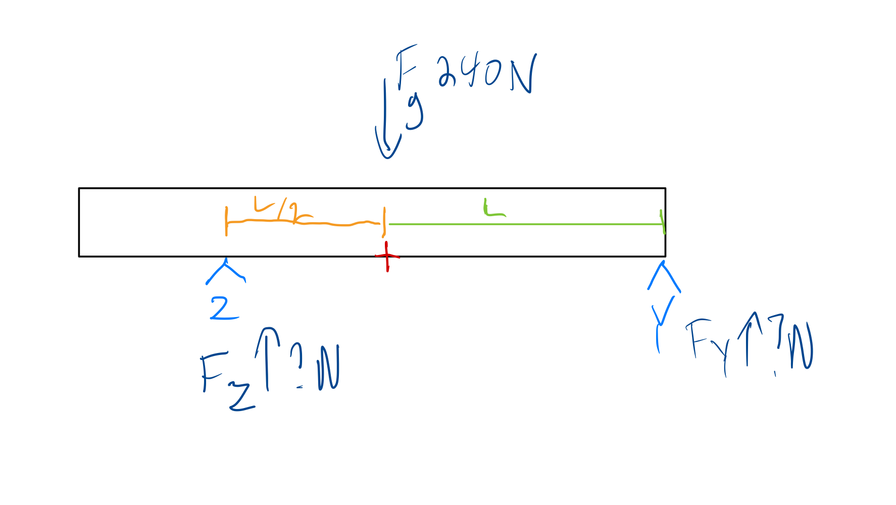

# Static Equilibrium

## Rigid Body

In order for a rigid body to be in static equilibrium, it has to be static (not moving) and in equilibrium (balanced).

That means that for each dimension, $x$, $y$, and $z$ the forces have to be balanced (sum to zero).

It also means that all torques must sum to zero.

We can use these two facts and develop a system of equations to solve for unknown forces.

Below is a drawing of an example problem:

Here, we have a static body weighing $240 N$ resting on two points, $Z$ and $Y$. Point $Z$ is $L/2$ units from the center point (which is marked with a red '+') and point $Y$ is $L$ units from the center point.

We will pick the center point here to act as the pivot point for calculating torque (although we could pick any point, the center point is easiest for this problem because lies in the same vertical line as the center of mass/gravity and therefore we can exclude the mass of the beam from the torque equation, and it makes calculating the torque from the normal force from the two points the beam is resting on simpler.

Here we only have forces in the $y$ direction - none in the $x$ or $z$ directions - so our force equation is:

$$ F_y = F_Z + F_Y - 240 = 0 $$

To calculate torque, remember that a force that causes rotation in the counterclockwise direction is chosen to be positive while a force that causes rotation in the clockwise direction is said to be negative. Our torque equation is then:

$$ -\frac{1}{2} L F_Z + L F_Y = 0 $$

This is a system of two unknowns and two equations, and solving it gives that $F_Y = 80,~F_Z = 160$.
