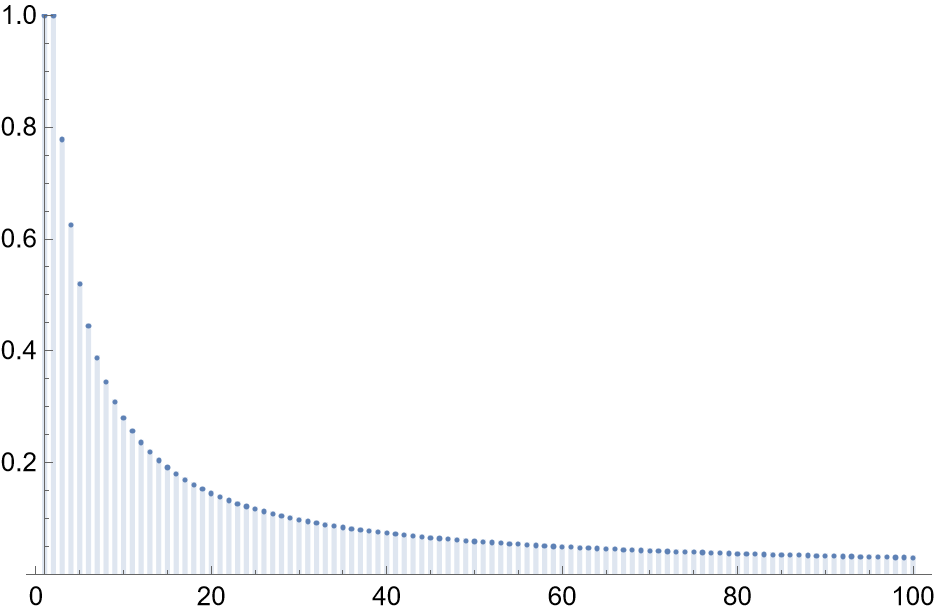

# Slot Machines

My dad told a story at dinner once about playing slots in Las Vegas. He doesn't gamble much, but he was there and had some time to kill, so he thought, "Why not, I'll give this a spin!" He put a \\$20 bill into a machine with three reels, and at \\\$1 per spin for a total of $20$ spins, he never even had two reels match, much less three! He said surely not having two reels match at least once in 20 spins is much more unlikely than having two reels match at least once, and wanted to know the odds. Someone pointed out that the machines don't have fair reels so it's impossible for an outsider to calculate the odds, but for the sake of getting to do some math, we can make some simplifying assumptions.

Since we don't know how many symbols there were on each reel, let's assume the same $n$ symbols are on each reel, that on each spin, each reel's result is independent of the others, that each spin is independent of the others, and that each of the $n$ symbols is equally likely to be chosen.

Then, there are $n \times n \times n = n^3$ possible combinations of results. For our purposes, favorable results are those where we have at least two matches across the reels. Getting two matches can happen when there are either exactly two matching reels, or if all three reels match.

First, we'll consider how many outcomes there are where exactly two reels match. There are three possible pairs of matching reels:

* reel one matches reel two
* reel one matches reel three
* reel two matches reel three

For each of those three pairs, there are $n$ symbols to choose from as the matching symbol, and $n-1$ symbols to choose from for the remaining, non-matching reel. So, there are $3 \times n \times (n-1)$ possible ways for exactly two reels to match.

All three reels match if they all have the same symbol; with $n$ symbols to choose from, this gives $n$ outcomes where all three match.

So, the total number of ways we have at least two reels with matching symbols is

$$ 3 \times n \times (n-1) + n = 3n^2 - 2n, $$

and the probabilty on any given spin that at least two match is

$$ \frac{3n^2 - 2n}{n^3} = \frac{3n - 2}{n^2}. $$

That's a bit abstract, but note that when $n$ is $1$ or $2$, we are guaranteed to have at least two reels matching, and that the odds decrease towards $0$ as $n$ gets larger. When there are $5$ symbols to choose from, the odds of having two reels match on any given spin are $52\%$; when there are $10$, the odds are $28%$. 

Here's a plot of the odds for up to $n = 100,$ where the probability of at least two reels matching on a given spin is still $2.98\%,$ which is surprisingly high!

So far we've covered the odds of having at least two matches across three reels on any given spin, but the original question was how likely it was, over twenty spins, to not have two reels match even a single time. Since the probability of any given spin having at least two matches is $\frac{3n - 2}{n^2}$, the probability of any given spin not having at least two matches is $1 - \frac{3n - 2}{n^2},$ and the odds of not getting two reels match across $20$ spins is

$$ (1 - \frac{3n - 2}{n^2})^{20}. $$

When there is only a single symbol, the probability of no spin having two matching reels is $0,$ because every spin will have at least two matching reels. As more symbols are added, it become more probable that there would be no spin with at least two matching reels.

Here's a plot for up to $n = 100$ symbols of the probability of not having a single instance of at least two matching reels across $20$ spins:

Most slot machines in Las Vegas have something like $10$ symbols; the probability of not having any two reels match on $20$ spins with $3$ reels and $10$ symbols are less than one percent, roughly $0.14\%!$ In order for it to be more likely than not to have no two reels match, there need to be at least $88$ symbols, which makes the odds about $50.2\%$ that there would be no spins with at least two reels matching across twenty spins.

My dad's intuition was right, and it's not even close! Don't play slots in Vegas, kids!