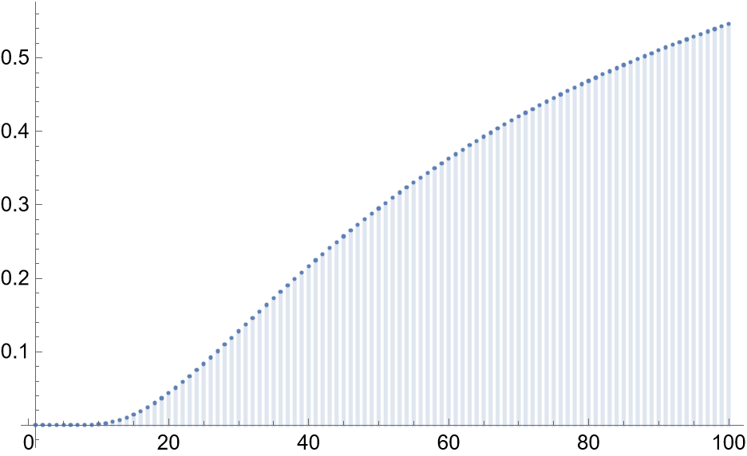
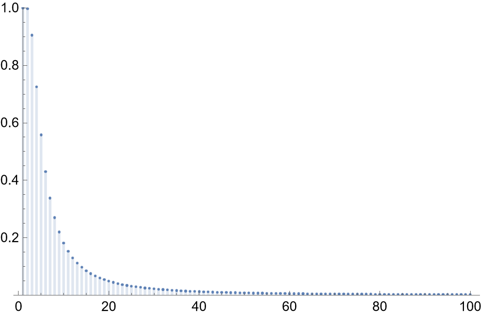

My dad told a story at dinner once about playing slots in Las Vegas. He doesn't gamble much, but he was there and had some time to kill, so he thought, "Why not, I'll give this a spin!" He put a \\$20 bill into a machine with three reels, and at \\\$1 per spin for a total of $20$ spins, he never even had two reels match, much less three! He said surely not having two reels match at least once in 20 spins is much less likely than having three reels match at least once, and wanted to know the odds. Someone pointed out that the machines don't have fair reels so it's impossible for an outsider to calculate the odds, but for the sake of getting to do some math, we can make some simplifying assumptions.

Since we don't know how many symbols there were on each reel, let's assume the same $n$ symbols are on each reel, that on each spin, each reel's result is independent of the others, that each spin is independent of the others, and that each of the $n$ symbols is equally likely to be chosen.

Then, our question is: which is the more likely outcome across $20$ spins?

a) No two reels match on any spins.
b) All three reels match on at least one spin.

## No Two Reels Match on Any Spin

First, we'll calculate the odds of no two reels matching on any of twenty spins. To do that, we'll first calculate the probability of having two reels match on a single spin.

### Two Reels Match on a Single Spin

There are $n \times n \times n = n^3$ possible combinations of results. For our purposes, favorable results are those where we have at least two matches across the reels. Getting two matches can happen when there are either exactly two matching reels, or if all three reels match.

First, we'll consider how many outcomes there are where exactly two reels match. There are three possible pairs of matching reels:

* reel one matches reel two
* reel one matches reel three
* reel two matches reel three

For each of those three pairs, there are $n$ symbols to choose from as the matching symbol, and $n-1$ symbols to choose from for the remaining, non-matching reel. So, there are $3 \times n \times (n-1)$ possible ways for exactly two reels to match.

All three reels match if they all have the same symbol; with $n$ symbols to choose from, this gives $n$ outcomes where all three match.

So, the total number of ways we have at least two reels with matching symbols is

$$ 3 \times n \times (n-1) + n = 3n^2 - 2n, $$

and the probabilty on any given spin that at least two match is

$$ \frac{3n^2 - 2n}{n^3} = \frac{3n - 2}{n^2}. $$

That's a bit abstract, but note that when $n$ is $1$ or $2$, we are guaranteed to have at least two reels matching, and that the odds decrease towards $0$ as $n$ gets larger. When there are $5$ symbols to choose from, the odds of having two reels match on any given spin are $52\%$; when there are $10$, the odds are $28\%$. 

Here's a plot of the odds for up to $n = 100,$ where the probability of at least two reels matching on a given spin is still $2.98\%,$ which is surprisingly high!

### No Two Reels Match Across Multiple Spins

So far we've covered the odds of having at least two matches across three reels on any given spin, but we need to know how likely it is, over twenty spins, to not have two reels match even a single time. Since the probability of any given spin having at least two matches is $\frac{3n - 2}{n^2}$, the probability of any given spin not having at least two matches is $1 - \frac{3n - 2}{n^2},$ and the odds of not getting two reels match across $20$ spins is

$$ (1 - \frac{3n - 2}{n^2})^{20}. $$

When there is only a single symbol, the probability of no spin having two matching reels is $0,$ because every spin will have at least two matching reels. As more symbols are added, it becomes more probable that there will be no spin with at least two matching reels.

Here's a plot for up to $n = 100$ symbols of the probability of not having a single instance of at least two matching reels across $20$ spins:

In order for it to be more likely than not to have no two reels match, there need to be at least $88$ symbols, which makes the odds about $50.2\%$ that there would be no spins with at least two reels matching across twenty spins.

## All Three Reels Match on At Least One Spin

Now, let's cover the odds of getting all three reels matching on at least one spin. On any given spin, with $n$ symbols, the probability of all three reels matching is $n/n^3 = 1/n^2,$ so the probability of not getting all three to match is $1 - 1/n^2$. Across $20$ spins, the probability that we never get three matching reels is then $(1 - 1/n^2)^{20},$ so the probability that we get three reels matching at least once is $1-(1 - 1/n^2)^{20}.$

When there is only one symbol, we are guaranteed to have every spin match on all three reels; adding more symbols makes the odds of this happening go down, and with 10 symbols the odds of getting at least one match on all three reels with 20 spins is only about $18.2\%$.

Here's a plot of the probability of getting all three reels to match at least once across $20$ spins with $n$ symbols:

## Comparing Results
Now that we've calculated the probability of these outcomes, we can compare them to see which is more likely.

Note that the probability of no two reels matching on any spins starts at $0$ for $n=1$ symbols and goes up as $n$ gets bigger, and that the probability of all three reels matching on at least one spin starts at $1$ for $n=1$ and gets lower as $n$ gets bigger. That means that which outcome is more likely to occur depends on how many symbols there are on the reels, and for some number of symbols, the outcomes will be relatively equally likely. We can find this number of symbols by equating the two probabilities and solving for $n$:
 
 $$ (1 - \frac{3n - 2}{n^2})^{20} = 1-(1 - 1/n^2)^{20}, \quad n \approx 20.4. $$

 Since we can't have $20.4$ symbols, the odds will never be exactly the same, but we can say that when there are $20$ symbols, the odds of getting all three reels to match at least once on $20$ spins is slightly higher than the odds of not getting any two reels to match at least once, and that when there are $21$ symbols, the odds of not getting any two reels to match at least once are slightly higher than the odds of getting all three reels to match at least once.

 So, at $n=20$ symbols and below the more likely outcome is that three reels match at least once in our $20$ spins, and at $n=21$ symbols and above, the more likely outcome is that no two reels match across all of our $20$ spins. 

## Conclusion

Most slot machines in Las Vegas have something like $10$ symbols; the probability of not having any two reels match on $20$ spins with $3$ reels and $10$ symbols are less than one percent, roughly $0.14\%,$ while the probability of having three reels match at least once is much higher at $18.2\%$

My dad's intuition was right, and it's not even close! After doing the calculations, I was very surprised by how unlikely my dad's experience would be on a slot machine with this simplified behavior. I know that the machines are tilted in the house's favor, but I would have expected them to behave in a way that more closely matches our intuitive sense of fairness, since it seems like that would be more likely to entice people to play more.

However, it's worth noting that even if our simplifying assumptions are accurate, this analysis alone doesn't say anything about the fairness of the machines since it doesn't account for how much is paid out on a match, and our expected return on investment is the probability of a match times the payout on a match. Even though the machines apparently artifically reduce the odds of a match, they could also inflate payouts to make up for it, bringing expected return on investment for a gambler over the long run to whatever value they want. In this case, we have no idea what the payout was, because my dad never won!